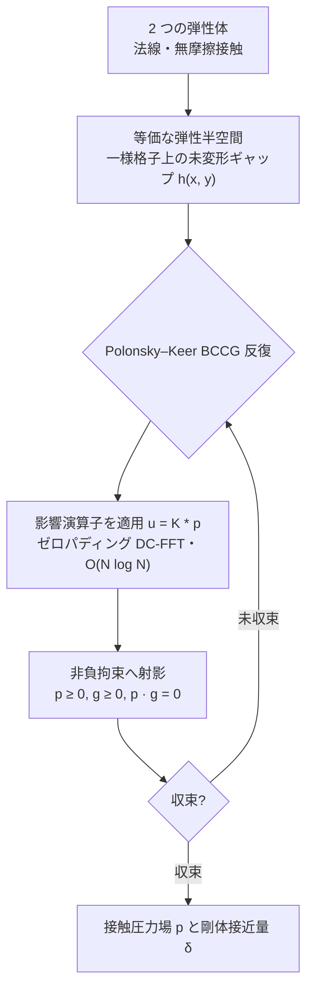
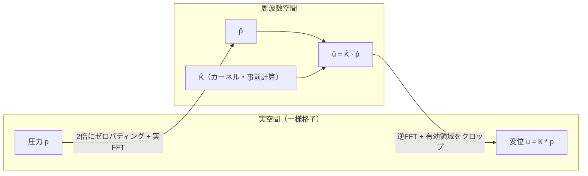
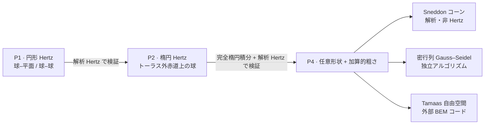
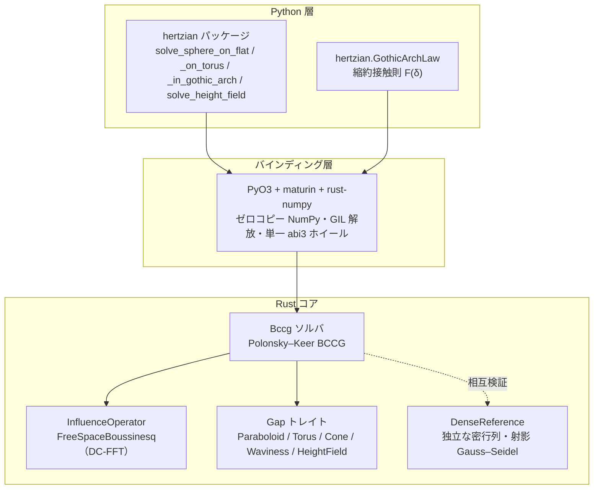
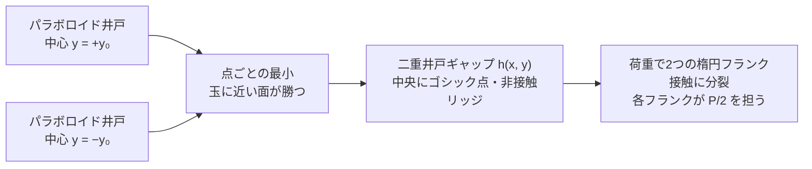
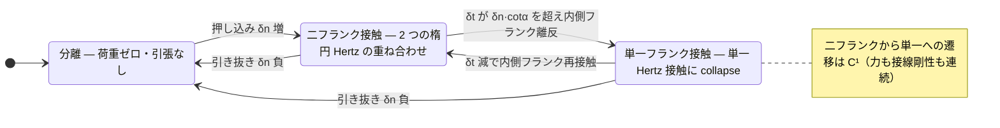
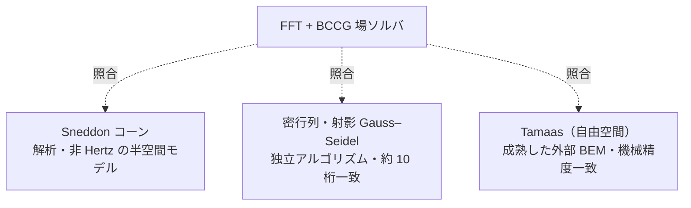

# hertzian

**FFT で高速化した弾性半空間の法線接触ソルバ — Rust コア + PyO3 バインディング。**

<p align="center">
  
</p>

<p align="center"><sub>コアが現在解く4つの接触問題を、それぞれ収束した接触圧力場で示します — 自由空間 DC-FFT + Polonsky–Keer BCCG、各ケースを解析解と照合済み。並列比較による検証は<a href="#ギャラリー--可視化">ギャラリー</a>を参照。</sub></p>

> **状態：P0–P4 完了（Draft 0.1）。**
> Rust コアは、ゼロパディング自由空間 DC-FFT と Polonsky–Keer BCCG ソルバにより、
> 円形（球–平面 / 球–球）および楕円（トーラス外赤道上の球）の Hertz 接触を解き、
> それぞれ解析解で検証済みです。P4 では**任意の高さ場形状と加算的な粗さ**（任意の
> `Gap` ＋粗さ層）を追加し、Sneddon の非 Hertz コーン、独立な密行列・射影
> Gauss–Seidel ソルバ、そして閉形式を持たない粗面接触については外部コード
> [Tamaas](https://gitlab.com/tamaas/tamaas) を自由空間演算子で動かして検証しています。
> **Python バインディング**（PyO3 + `maturin`、ゼロコピー NumPy、ソルブ中は GIL 解放、
> CPython 3.11+ 向けの単一 `abi3` ホイール）がソルバを公開し、ベンチマークを Python から
> 再現します。周期境界とマルチボディ接触はロードマップに残っています。

---

## 概要

二つの弾性体の**法線・無摩擦接触**を、両者を**弾性半空間**で近似し、接触界面を
**共通平面上の一様格子**で離散化して解くソルバです。圧力分布 $p$ と表面変位 $u$ の関係は
**畳み込み** $u = K * p$ となり、畳み込み定理により **FFT** で
$O(N^2) \to O(N\log N)$ に高速化できます：

$$u = K * p \qquad \overset{\text{FFT}}{\Longrightarrow} \qquad \hat{u} = \hat{K}\cdot\hat{p}$$

非貫入・非引張の拘束 $\bigl(p \ge 0,\ g \ge 0,\ p\,g = 0\bigr)$ は **Polonsky–Keer 型の
制約付き共役勾配法（BCCG）** で解きます。自由空間（非周期）の Hertz 接触を正しく
扱うため、**ゼロパディング DC-FFT** を用います。



各反復のコストは影響演算子の適用 $u = K * p$ に集約され、これがゼロパディング DC-FFT で
$O(N\log N)$ に落ちます。素朴な FFT は*巡回*畳み込みを返し、これは接触の周期的タイリングに
相当して孤立 Hertz 接触には不適です。そこで両オペランドを格子の 2 倍にゼロパディングし、
カーネルをラップアラウンド順に並べることで、巡回畳み込みを元の領域上で*線形*（自由空間）
畳み込みに一致させます：



> 一様格子は**必須**です：非一様格子では畳み込み構造（ひいては FFT による高速化）が
> 成り立ちません。

### 設計方針

単一接触の生の速度よりも、**任意形状・表面粗さ・マルチボディ接触**への拡張性を
優先します。

### 検証ロードマップ

1. **円形接触** — 球–平面 / 球–球。解析的な Hertz 解で検証。
2. **楕円接触** — トーラス外軌道に対する球（凸–凸）。非軸対称の機構全体を動かす。
3. **任意の高さ場形状と粗さ** — 半空間近似の範囲で、任意のサンプリングされたギャップ＋
   加算的な粗さ層。Sneddon のコーン（解析的・非 Hertz）、独立な密行列ソルバ、Tamaas で
   相互検証（後述の[相互検証](#相互検証)を参照）。



### v1 のスコープ外

摩擦・接線接触、弾塑性・粘弾性、コーティング、凝着（JKR/Maugis）、強保形接触、
GPU 実行。これらは v1 では未実装ですが、アーキテクチャはそのためのトレイト境界を
確保しています。

### 先行研究

[Tamaas](https://gitlab.com/tamaas/tamaas)（EPFL、C++/Python、FFTW + OpenMP）が
最も成熟した近縁ライブラリですが、既定では周期境界です。ネイティブな `pip` ホイールとして
配布できる Rust + PyO3 実装が本プロジェクトの差別化点です。Tamaas は非周期演算子も
備えており、P4 ではこれを自由空間の相互検証の基準として使います（[相互検証](#相互検証)を参照）。

---

## 技術スタック

| レイヤ              | ツール                                                         |
| ------------------- | ------------------------------------------------------------- |
| 数値コア            | Rust — `ndarray`, `rustfft` / `realfft`, `rayon`              |
| Python バインディング | `PyO3` + `maturin` + `rust-numpy`（ゼロコピー NumPy 連携）      |
| Python 環境 / 開発   | [`uv`](https://docs.astral.sh/uv/)（必須 — 生の Python は不可） |
| 静的解析            | `ruff`（lint+format）、`mypy --strict`、`clippy -D warnings`    |

ソルバは**機能的コア / 命令的シェル**で構成され、ジオメトリ（`Gap`）と弾性応答
（`InfluenceOperator`）はトレイト境界の裏に隠れています。新しい形状やカーネル
（周期・層状など）は、ソルバに触れず impl を1つ足すだけで差し込めます。



---

## 使い方（Python）

```python
import numpy as np
import hertzian

# 解析的なショートカット：円形 Hertz（平面上の球）。`domain` は（原点中心の）正方形
# 界面格子の物理的な幅（メートル）。
sol = hertzian.solve_sphere_on_flat(
    radius=10e-3, load=50.0, e_star=70e9, grid=(256, 256), domain=1.2e-3
)
print(sol.contact_radius, sol.max_pressure, sol.approach)
print(sol.diagnostics)            # 反復回数、残差、収束フラグ
pressure = sol.pressure           # (nx, ny) float64 NumPy 配列（軸 0 = x）

# 楕円 Hertz：トーラス外赤道上の球（凸–凸、P2）。
sol = hertzian.solve_sphere_on_torus(
    sphere_radius=12e-3, tube_radius=4e-3, centre_radius=20e-3,
    load=60.0, e_star=100e9, grid=(256, 256), domain=1.2e-3,
)
print(sol.contact_half_widths, sol.ellipticity)

# 応用例：ゴシックアーチ（尖頭）軸受溝に押し込まれた玉 — 2つの円弧（2トーラス）を
# 重ね、保形度 r/Rs = 1.04。centre_offset を非ゼロにする（円弧中心のシム）と玉は2つの
# フランクに乗り、接触は2つに分裂する。centre_offset=0 なら単一の保形楕円接触に戻る。
# 分裂方向（子午線 y）軸に沿って縦長のドメイン。
sol = hertzian.solve_sphere_in_gothic_arch(
    sphere_radius=4e-3, tube_radius=4.16e-3, centre_radius=15e-3,
    centre_offset=65e-6, load=800.0, e_star=100e9,
    grid=(96, 846), domain=(0.65e-3, 5.74e-3),
)
print(sol.max_pressure)  # 2つのフランクパッチ、各々 P/2 での楕円 Hertz 接触

# 汎用エントリポイント（P4）：任意の未変形ギャップ高さ場 h(x, y) — 任意の形状、
# 必要なら粗さを上乗せ。中心揃えの一様格子上でギャップを構築し、ソルバへ渡す。
nx, ny = 256, 256
dx = dy = 1.2e-3 / nx
x = (np.arange(nx) - (nx - 1) / 2) * dx
y = (np.arange(ny) - (ny - 1) / 2) * dy
sphere = (x[:, None] ** 2 + y[None, :] ** 2) / (2 * 10e-3)          # 滑らかなベース
roughness = (                                                       # 加算的なうねり
    0.2e-6
    * np.cos(2 * np.pi * x[:, None] / 1e-4)
    * np.cos(2 * np.pi * y[None, :] / 1e-4)
)
sol = hertzian.solve_height_field(
    gap=np.ascontiguousarray(sphere + roughness), load=50.0, e_star=70e9, dx=dx, dy=dy
)
print(sol.contact_area, sol.max_pressure)
```

`e_star` は等価弾性係数 $E^*$ で、$\dfrac{1}{E^*} = \dfrac{1-\nu_1^2}{E_1} + \dfrac{1-\nu_2^2}{E_2}$
です。ソルバは GIL を解放して動くため、呼び出しは Python スレッド間で並列化されます。
v1 では自由空間境界のみ実装されており、`boundary="periodic"` は予約済みで
`NotImplementedError` を送出します。

---

## ギャラリー / 可視化

ソルバが**現在解いている問題**を、収束した**圧力場**と、それを裏づける**解析解**の
両方で示します。各図の左が圧力場、右が解析解との比較で、滑らかな Hertz 接触は閉じた
形と、コーンは Sneddon の閉形式と、粗い接触はスムーズ基準に対する**接触の分裂とピーク
圧の上昇**で確認できます。右側の閉形式は Rust コアとは独立に
[`scripts/render_gallery.py`](./scripts/render_gallery.py) で再導出しているため、各パネルは
ソルバが自分自身ではなく基準解に一致していることを示します。

### 円形 Hertz — 平面上の球（P1）


軸対称のベンチマーク。圧力場（左）は解析的な接触円（破線）を満たします。**全**格子セルの
圧力を $r/a$ に対してプロットすると（右）、場全体が Hertz 楕円体に重なります：

$$p(r) = p_0\sqrt{1 - (r/a)^2}$$

ここでは $a \approx 0.175\,\mathrm{mm}$、$p_0 \approx 780\,\mathrm{MPa}$ で、約 0.2 % 一致。

### 楕円 Hertz — トーラス外赤道上の球（P2）


凸–凸接触は楕円になります — 周方向（$x$）が子午線方向（$y$）より長い。測定されたパッチは
解析的な接触楕円（破線、$a_x/a_y \approx 1.92$）を追従し、各主軸に沿った断面は解析的な
半楕円体プロファイルに乗ります：

$$p(x, y) = p_0\sqrt{1 - (x/a_x)^2 - (y/a_y)^2}, \qquad p_0 \approx 1.74\,\mathrm{GPa}.$$

離心率 $e$ は、完全楕円積分 $K(e),\ E(e)$ で解いた超越的な曲率関係
$\dfrac{E/(1-e^2) - K}{K - E} = \dfrac{R_x}{R_y}$ から決まります。

### Sneddon のコーン — 非 Hertz・尖点特異の圧子（P4）


**任意**（非放物面）のギャップ $h = m\,r$ を、任意の測定面と同じ高さ場の経路に通します。
Hertz と違って圧力は尖点で対数的に発散するため、（メッシュで決まる）ピークは比較**しません** —
しかし半径方向プロファイルは Sneddon の閉形式に従います：

$$a = \sqrt{\frac{2P}{\pi E^* m}}, \qquad \delta = \frac{\pi}{2}\,m\,a, \qquad p(r) = \frac{E^* m}{2}\operatorname{arccosh}\!\frac{a}{r}.$$

接触半径 $a \approx 0.138\,\mathrm{mm}$ は閉形式と約 0.2 % 以内で一致します。

### 粗面接触 — 球＋粗さ、分裂（P4）


滑らかな球に余弦状の粗さ $h_r = A\cos(2\pi x/\lambda_x)\cos(2\pi y/\lambda_y)$ を重ねる
（単純な高さ場の加算）と、単一の Hertz 円板が**突起接触**の格子に分裂します。*同じ*荷重の
もとで、実接触面積は滑らかな円板の約 ¼ に減り、ピーク圧は約 5.6 倍に上がります — 粗面
接触の物理的な符牒です。粗いパッチは閉形式を持たないため、独立な密行列ソルバおよび
Tamaas と相互検証します（次節）。

> ギャラリーは `make gallery`（または
> `uv run --with matplotlib python scripts/render_gallery.py`）で再生成します。matplotlib は
> 描画専用の依存で、後述の Tamaas 相互検証と同様、リリース周期がコアのパイプラインを壊さないよう、
> 意図的にロック環境から外しています。

---

## 応用例 — ゴシックアーチ軸受溝

ボールベアリングの軌道溝は、単一円弧ではなく**中心をずらした2つの円弧**（=2トーラスを
重ねた凹面）で研削されることが多く、尖頭のオージー形＝**ゴシックアーチ**になります。
玉はこの溝の底ではなく**2つのフランクに乗り**、接触は2点に**分裂**します。これは新しい
ソルバ機能ではなく、検証済みの**楕円接触プリミティブの応用**で、$r/R_s = 1.04$（玉径に
対する溝半径52%という教科書的な保形度）の保形接触です。


溝のギャップは二重井戸型に帰着します — 中心をずらした2つの楕円放物面で、玉に最も近い面が
勝ちます（点ごとの最小）：

$$h(x, y) = \frac{x^2}{2 R_x} + \frac{(|y| - y_0)^2}{2 R_y}.$$



子午線半径は**保形**で $R_y = \dfrac{1}{1/R_s - 1/r}$（凹溝）、周方向半径は凸で
$R_x = \dfrac{1}{1/R_s + 1/R_0}$、フランクオフセットは
$y_0 = \texttt{centre\_offset}\cdot\dfrac{R_s}{r - R_s}$ です。微小な円弧中心のシムは
保形度によって**約 25 倍に増幅**され、65 µm のシムがフランクを ±1.6 mm 引き離します。
*同じ*全荷重で、単一アーチ（$\texttt{centre\_offset} = 0$）は1つの楕円パッチを作りますが、
ゴシックのシムはそれを2つに分裂させます。

この分裂は**荷重保存的かつ自己検証的**です：各フランクは荷重の**半分**を担う楕円 Hertz
接触なので、そのピークは **P2 ベンチマークが使うのと同じ閉形式**に乗ります — ここでは
$p_0 \approx 1.74\,\mathrm{GPa}$ で、楕円 Hertz のギャラリーパネルと一致し、単一アーチピーク
（$\approx 2.19\,\mathrm{GPa}$）のちょうど $(1/2)^{1/3} \approx 0.79$ 倍です。$y = 0$ のゴシック点は
荷重を担いません。上の数値（$R_s = 4\,\mathrm{mm}$、$r = 4.16\,\mathrm{mm}$、
$R_0 = 15\,\mathrm{mm}$、$E^* = 100\,\mathrm{GPa}$、$P = 800\,\mathrm{N}$）は、フランク圧が
ギャラリーの GPa 域に入るよう調整したものです。$P/2$ での楕円 Hertz とのフランクごとの
等価性、および非接触のリッジは、Rust のシナリオテストと Python バインディングテストに
固定されています。

### シムの調整 — 半分だけ重なる2つのフランク

同じ溝のまま**シムを詰める**と、2つのフランク接触は離れたままではなく、**接触楕円が
半分ずつ重なり合う**ところまで近づきます。設計目標は子午線方向のフランクオフセット
$y_0 = b/2$（$b$ は半荷重の孤立フランク楕円の子午線半軸）。半軸 $b$ の2つの楕円の中心が
$b$ だけ離れていれば、互いに**半分ずつ**を共有します。重なりは**ゴシック点を埋め**、接触は
一続き（連結）になります——分離アーチの非接触リッジとは対照的です。$|y|$ の折り返しは
そのままなので、**左右対称**も変わりません。


重なり領域には**閉形式がありません**——2つのフランクは弾性場を通じて**相互作用**し、荷重は
もはやきれいに $P/2$ ずつには分かれません。重なりはピーク圧を分離時の $(1/2)^{1/3}$ 値より
**押し上げ**ますが、単一アーチ（$y_0 = 0$）のピークより**下**に留まります（ここでは
$\approx 1.85\,\mathrm{GPa}$、分離フランクの $1.74\,\mathrm{GPa}$ と単一アーチの
$2.19\,\mathrm{GPa}$ の間）。$20\,\mu\mathrm{m}$ のシムが $y_0 \approx 0.51\,\mathrm{mm}$ を
与えます。解析的な拠り所がないので、検証は **P4 方式**——同じ格子上の独立な密行列・射影
Gauss–Seidel 参照解との相互検証——で行います。重なりの符牒（**連結**して荷重を担うゴシック点と、
**サドル**でつながる左右対称の2フランク）は、Rust のシナリオテストと Python バインディング
テストに固定されています。

---

## 縮約接触則 — マルチボディ動力学のための軽量 `F(δ)`

単一の滑らかな Hertz 接触は、$F = k\,\delta^{3/2}$ と力の向き $\mathbf{e}\parallel(\mathbf{x}-\mathbf{o})$
という**2入力2出力**の代数式で表せます。しかしゴシックアーチ溝のように玉が**2つのフランク**に
乗る複雑形状では、もはや単一の代数式には収まりません。一方でマルチボディ動力学の
ような繰り返し計算では、毎ステップ FFT ソルバを回す余裕はありません。そこで検証済みの
場のソルバを**軽量な力則 $F(\delta)$** に蒸留し、形状に合わせて**回帰でフィッティング**します。

### モデル

溝の子午断面で、玉中心の変位 $\boldsymbol{\delta} = (\delta_t, \delta_n)$（横断 $\hat{t}$ ・
法線 $\hat{n}$）が、接触半角 $\pm\alpha$ だけ傾いた2つのフランク法線
$\hat{n}_\pm = (\pm\sin\alpha,\ \cos\alpha)$ 方向に各フランクを押し込みます。各フランクは
（引張なし＝正の部分 $\lfloor\cdot\rfloor_+$ のみ）Hertz 荷重を担い、合力はそのベクトル和です：

$$
\begin{aligned}
s_\pm &= \boldsymbol{\delta}\cdot\hat{n}_\pm = \delta_n\cos\alpha \pm \delta_t\sin\alpha, \\[2pt]
Q_\pm &= K\,\lfloor s_\pm\rfloor_+^{3/2}, \\[4pt]
F(\boldsymbol{\delta}) &= Q_+\,\hat{n}_+ + Q_-\,\hat{n}_-
  \;\Longrightarrow\;
  F_t = (Q_+ - Q_-)\sin\alpha,\quad
  F_n = (Q_+ + Q_-)\cos\alpha.
\end{aligned}
$$

上から順に、各フランクの**接近量** $s_\pm$（フランク法線 $\hat{n}_\pm$ への射影）、各フランクの
**Hertz 荷重** $Q_\pm$、そして合力 $F$ とその横断・法線成分 $(F_t, F_n)$ です。
$K$ は1フランクの楕円 Hertz 荷重–変位定数、$\alpha$ は幾何学的な接触角（ここでは
$\alpha \approx 24^\circ$）です。これは単一 Hertz 接触の $F = k\,\delta^{3/2}$ を2フランクに
重ね合わせた、2入力2出力の閉形式そのものです。

### 境界条件 — 2溝→1溝の微分連続（`C¹`）

荷重が傾くと内側フランクが除荷し、$\delta_t = \delta_n\cot\alpha$ で**離れ**ます。接触は
**2フランクから1フランク**へ移り、力則は単一 Hertz 接触 $F = K\,s_+^{3/2}\,\hat{n}_+$
（README の1溝の $F = k\,\delta^{3/2}$、$\mathbf{e}\parallel(\mathbf{x}-\mathbf{o})$）に
collapse します。



**この遷移は `C¹`** ——力**と**そのヤコビアン（接線剛性）がともに連続です。理由は Hertz
指数 $3/2 > 1$：除荷するフランクは荷重**も**剛性**も**ゼロで噛み合うため、
$Q_- \propto s_-^{3/2}\to 0$ かつ $\mathrm{d}Q_-/\mathrm{d}s_- \propto s_-^{1/2}\to 0$。
**1.5乗こそが、滑らかな2→1の受け渡しを保証する構造**です。ただし `C²` ではありません——
接線剛性は $\sqrt{\ \cdot\ }$ のカスプ（$\mathrm{d}^2Q/\mathrm{d}s^2 \propto s^{-1/2}\to\infty$）を
持ち、これは Hertz 接触が無限初期勾配で硬化する、おなじみの符牒です。

解析的な接線剛性（カップリングを切った $\kappa = 0$ の形）は、各フランクの接線
$g_\pm = \tfrac{3}{2}K\,\lfloor s_\pm\rfloor_+^{1/2}$ を用いて

$$
\frac{\mathrm{d}F}{\mathrm{d}\boldsymbol{\delta}} =
\begin{bmatrix}
(g_+ + g_-)\sin^2\alpha & (g_+ - g_-)\sin\alpha\cos\alpha \\
(g_+ - g_-)\sin\alpha\cos\alpha & (g_+ + g_-)\cos^2\alpha
\end{bmatrix}
$$

となり、フランクが除荷すると $g_\pm\to 0$ なので行列は離反シームを越えて連続（=`C¹`）、
一方その微分は $g_\pm\propto\sqrt{s_\pm}$ で発散するので `C²` ではありません。

### 隣のフランクが相手を持ち上げる — 一次の弾性カップリング

2フランクを**独立**な Hertz 接触として重ね合わせるのは、両者が十分に離れているときだけ
厳密です——分離極限では各フランクが半荷重を担い、有効フランク数 $\eta = P/(K\,\delta^{3/2})$ は
$2$ です。シムを詰めて2つのフランク接触が近づくと弾性場が重なり、**一方のフランクの荷重
$Q$ が、もう一方の真下の半空間を持ち上げ**、隣の接近量——ひいては荷重——を削ります。一次
では各フランクは相手の Boussinesq 遠方場、すなわち距離 $d = 2 y_0$（フランク中心は
$y = \pm y_0$）にある点荷重 $Q$ を見ます：

$$u \approx \frac{Q}{\pi E^* d}, \qquad d = 2 y_0.$$

そこで2つの**実効**接近量は、自分たちが決める荷重を通じて連立します：

$$s_\pm^{\text{eff}} = s_\pm - \kappa\,Q_\mp, \qquad Q_\pm = K\,\lfloor s_\pm^{\text{eff}}\rfloor_+^{3/2}, \qquad \kappa = \frac{1}{2\pi E^* y_0}.$$

小さな $2\times 2$ の自己無撞着解（`with_flank_coupling` で有効化）です。閉形式の安さも解析
ヤコビアンも `C¹` もそのまま——除荷するフランクは荷重**も**剛性**も**持ち上げ**も**ゼロで
噛み合い、$y_0 \to \infty$ で $\kappa \to 0$ と分離極限（$\eta = 2$）に戻ります。これは縮約則の
適用範囲を「十分分離」から「半重なり」まで広げる、検証済みプリミティブへの**一次の相互作用項**です。

このリフトは**大きさ**の補正で、フランク接近量の枠（`coupled_loads`）に効くので、荷重分割
$P_+ : P_-$（=力がどちらのフランクに分かれるか）まで含めて設定します。一方、向きにはもう一段
細かい**二次**効果が残ります：重なると各フランクは隣の**内側**をより強く持ち上げるので、荷重
重心が幾何オフセット $y_0$ の**外側**へずれます（場ソルバでは半重なりで $y_0$ の約 36 % 外、
分離すれば $y_0$ に戻る）。これがフランク**法線の回転**——より急な実効接触角
$\alpha_\text{eff}(y_0/b) = \arcsin(y_c / R_s)$（荷重重心 $y_c$、分離側で $\alpha$ に戻る）——で、
その実効角で法則を組めば適用できます。これは $(F_t, F_n)$ の射影だけを直し、本段で検証する
$\eta$／分割には効かないので、完全合体（$\eta \to 1$：単一アーチへのブレンド）とともに次段に
残します。重心の外側シフトは `gothic_overlap_shifts_the_load_centroid_outboard` で固定しています。

### 横から見た断面 — 球・2トーラス・荷重ベクトルで見るカップリング

ここまでの図は接触**面**を上から見たもの（圧力場と子午線断面）でした。下図は**横から見た断面**で、
元に想定した形状——**球**（玉）が**2つのトーラス**（管半径 $r$ の2円弧）に挟まれた溝——に
**荷重ベクトル**を重ね、**厳密解**（FFT+BCCG 場ソルバ）と**近似解**（縮約則）を並べます。シムを
開くにつれ、1つの楕円接触が2つの傾いたフランクに分かれ、一次カップリングが有効フランク数
$\eta = P/(K\,\delta^{3/2})$ を素朴な $2$ から引き下げる様子を、3つの領域で示します。


各パネルの上段が**横から見た断面**、下段がその**子午線圧力断面**（厳密＝ソルバ、近似＝解析 Hertz）です。
荷重ベクトルは、2つのフランク反力 $Q_\pm = P/(2\cos\alpha)$ がフランク法線 $\hat{n}_\pm$ を向き、その
鉛直成分の和が外部荷重 $P$ に釣り合うことを示します。

- **(a) 単一アーチ — 1楕円。** シムなしで2円弧は一致し、接触は全荷重を担う単一の楕円 Hertz パッチ。
  荷重ベクトルはまっすぐ上向き（$\alpha = 0$）で $\eta = 1$。ソルバのピーク（$\approx 2.18\,\mathrm{GPa}$）は
  解析 Hertz（全荷重）と **0.1 % 以内**で一致します。
- **(b) 半重なり — その中間。** $y_0 = b/2$ までシムを開くと2つのフランク楕円が半分重なります。接触が
  近づいて弾性場が重なり、各フランクが相手の真下を持ち上げるため、$\eta$ は素朴な $2$ から**大きく
  下がり**（ソルバ $1.44$）、一次の coupled 則が $1.54$ までその落ち込みのほとんどを回収します
  （残差 ~7 %、点荷重近似が最も弱い最深部）。子午線断面では、ソルバの連結したピークが半荷重フランクの
  半楕円**より上**を走ります——重なりの補強です。
- **(c) 分離2フランク — 左右対称。** さらにシムを開くと（ギャラリーの 65 µm 溝、$\alpha \approx 24^\circ$）、
  明確に分離した左右対称の2フランク接触になります。カップリングは薄れ $\eta \to {\sim}2$
  （ソルバ $1.83$、coupled $1.84$）。ソルバのピークは半荷重 Hertz の半楕円に乗ります。

管半径は近保形（$r/R_s = 1.04$）で、実寸では2円弧がミクロン単位で重なって見分けられないため、断面では
管半径を**模式的に拡大**して2つのトーラスを離して描いています（接触角 $\alpha$ と接触位置 $\pm y_0$ は
厳密値）。図は `make gallery`（または
`uv run --with matplotlib python scripts/render_coupling_cross_section.py`）で再生成します。

### フィッティングと検証


$K$ は単一アーチの荷重スイープから較正します：自由勾配の回帰が Hertz 指数 **1.500**
（理論値 1.5）と $K = P/\delta^{3/2}$ を **$R^2 = 1.000000$** で復元し（パネルA、解析 $K$ と
**0.2 %** 一致）、2フランクは $2K$ 線に重なって**重ね合わせ**を確認します。パネルB は較正済み
の $F(\delta_t, \delta_n)$ を横断方向にスイープし、離れの先で単一 Hertz 漸近線に滑らかに乗る様子
（`C¹`）を示します。パネルC は除荷フランクが普遍曲線 $Q_-/Q_-(0) = (1-\xi)^{3/2}$ に従い
**接線的にゼロへ**接する様子で、ソルバの非対称ウェル実験のマーカーが（**3 %** 以内で）その上に
乗ります——**3/2乗が `C¹` そのもの**。パネルD はシムを詰めると有効フランク数
$\eta = P/(K\,\delta^{3/2})$ が **1.95**（分離した2フランク）から半重なりへ向けて 2 を割り込む様子で、
**隣のフランクが相手を持ち上げる一次カップリング**（紫線、$u \sim Q/(\pi E^*\cdot 2 y_0)$）が
$\eta = 2$ からのずれをほぼ埋め、ソルバ点（橙）を半重なり域まで追従します。大きさ（$\eta$）の
一致は半重なりで**数 %**以内・分離側で **1 % 未満**、向き（荷重分割 $P_+ : P_-$）も重なりの
入口で数 % 以内に再現します。最も詰めた半重なりでは点荷重近似が最も弱く残差が ~7 % まで開き、
ここから完全合体（$\eta \to 1$）までは単一アーチをアンカーにしたブレンドとして次段に分けます。
$\eta$ と分割は Rust のシナリオテスト（`gothic_coupling_tracks_the_effective_flank_count`、
`gothic_coupling_captures_the_load_split`）に固定しています。

これは新しいソルバ機能ではなく、**検証済みプリミティブの蒸留**です：閉形式の $F(\delta)$ は
FFT を一切呼ばず `powf` 数回で評価でき、マルチボディの内側ループに直接置けます。Rust コア
（`hertzian::GothicArchLaw`、解析ヤコビアン付き）と Python バインディング
（`hertzian.GothicArchLaw`）の両方で公開し、`C¹` と Hertz 極限、ソルバとの一致を Rust／
Python テストに固定しています。図は `make gallery`（または
`uv run --with matplotlib python scripts/fit_reduced_law.py`）で再生成します。

```python
import hertzian

# フランク形状から法則を一度だけ較正する（実行時に FFT ソルブなし）。
law = hertzian.GothicArchLaw.from_elliptic_flank(
    radius_x=3.31e-3,  # 1フランクの周方向の相対半径
    radius_y=0.104,  # 子午線方向の（保形）相対半径
    e_star=100e9,
    contact_angle=hertzian.contact_half_angle(offset=1.6e-3, ball_radius=4e-3),
)

# 半重なりまで使うなら、隣のフランクの持ち上げ（一次カップリング）を有効化する：
law = law.with_flank_coupling(e_star=100e9, offset=1.6e-3)  # κ = 1/(2π E* y0)

# あとはマルチボディの内側ループで F(δ) と接線剛性を評価する：
f_t, f_n = law.force(2e-6, 6e-6)  # 接触力ベクトル (N)
stiffness = law.jacobian(2e-6, 6e-6)  # 2x2 接線剛性 dF/dδ (N/m)

# クーロン摩擦には合力 F だけでなく面圧分布が要る：各フランクの（カップリング後の）
# 荷重から、楕円 Hertz 半楕円体のキャップ p(x, y) を立方根スケールで得る（FFT 不要）。
q_plus, q_minus = law.flank_loads(2e-6, 6e-6)  # カップリング込みのフランク荷重 (N)
cap = law.flank_pressure(q_plus)  # 1フランクの面圧 footprint
p0 = cap.peak_pressure  # ピーク圧 p0 = 3Q/(2π a_x a_y) (Pa)
tau_max = cap.traction_bound(0.12, 0.0, 0.0)  # 局所クーロンキャップ μ p(x, y) (Pa)
```

### 面圧分布 — クーロン摩擦のための軽量キャップ

ここまでの $F(\boldsymbol{\delta})$ は**合力**です。しかしクーロン摩擦は局所的で、接線トラクションは
各点で面圧に $|\tau(x,y)| \le \mu\,p(x,y)$ と**キャップ**されます。つまり合力だけでは足りず、
**面圧分布** $p(x,y)$ そのものが要ります。各フランクは（カップリング後の）荷重 $Q_\pm$ を担う楕円
Hertz 接触なので、その面圧はおなじみの半楕円体です——各フランク中心 $\pm y_0$ に置きます：

$$
p(x,y) = p_0\sqrt{\left\lfloor 1 - \Bigl(\tfrac{x}{a_x}\Bigr)^2 - \Bigl(\tfrac{y\mp y_0}{a_y}\Bigr)^2\right\rfloor_+},
\qquad |\tau(x,y)| \le \mu\,p(x,y).
$$

形状は**一度だけ**——$K$ を較正したのと同じフランクから——決まります。Hertz の荷重スケール則で
接触半軸は $a = \hat{a}\,Q^{1/3}$ なので、ピーク圧も立方根スケールし、

$$
p_0 = \frac{3Q}{2\pi a_x a_y} = c_p\,Q^{1/3},\qquad c_p = \frac{3}{2\pi\,\hat{a}_x \hat{a}_y},
$$

`flank_pressure(Q)` は `cbrt` 数回で済みます——内側ループに離心率の超越解はありません。$Q = K\,s^{3/2}$
なので $p_0 = c_p K^{1/3}\sqrt{s}$：面圧キャップは離反点で $\sqrt{s}$ としてゼロに**接して**消え、力を `C¹` に
する 1.5 乗の符牒がここにも現れます。半楕円体は $Q$ ちょうどに積分される（$\iint p\,\mathrm{d}A = Q$）ので、
全滑り時の摩擦合力は1フランクあたり $\iint \mu\,p\,\mathrm{d}A = \mu Q$ です。


このキャップは、2つのフランクが**別々のパッチとして分解**できる**分離領域**——本節が題材にする
2フランク軸受——で1フランクごとに厳密です。ピーク圧スケール $p_0 = c_p Q^{1/3}$ を単一アーチの荷重
スイープに固定するとソルバ／理論線は **0.998**（パネルA、立方根の散らばりはゼロ）；分離溝（65 µm）では
ソルバの子午線断面に再構成した2つの半楕円体が乗り、**ピークは厳密**・断面は **~2 %**（パネルB）。パネルC
は2-Dのクーロンキャップ $\mu p(x,y)$ で、接線モデルが下に潜るべき2楕円の footprint をソルバの接触縁と
ともに描きます。シムを詰めて2つの footprint が**重なる**（$y_0 < a_y$）と、接触は一続きの連結パッチに
合体し、単純な重ね合わせは継ぎ目を**過大評価**します（パネルD：分離側 $y_0/b \ge 1$ ではピーク誤差
0.1 %）。この単一パッチへの合体は、完全合体（$\eta \to 1$：単一アーチへのブレンド）と**同じ次段**に残します。

$p_0$ の立方根スケール、半楕円体の積分一致、分離側でのソルバとの一致は、Rust のシナリオテスト
（`gothic_flank_pressure_caps_the_field_solver`）と Rust／Python のユニットテストに固定しています。図は
`make gallery`（または `uv run --with matplotlib python scripts/render_pressure_distribution.py`）で再生成します。

---

## 相互検証

滑らかな Hertz 接触は閉形式と照合できますが、任意形状 — とくに**粗面**接触 — には
解析的な基準がありません。P4 はこれらを独立な3つの方法で検証します：



| 検証 | 何を固定するか | 場所 |
| ----- | ------------ | ----- |
| **Sneddon のコーン** | 非 Hertz・尖点特異の形状に対する半空間*モデル*（厳密な接触半径 / 接近量 / 荷重） | `cone_on_flat`, `SneddonCone`（Rust）；`test_cone_matches_sneddon`（Python） |
| **密行列・射影 Gauss–Seidel** | *反復ソルバ*そのもの。同じカーネル上を無関係なアルゴリズムで解き、分裂した粗いパッチで約10桁一致 | `DenseReference`（Rust）；`rough_sphere_cross_validates_against_the_dense_reference` |
| **Tamaas（自由空間）** | *実装*そのもの。成熟した外部 [Tamaas](https://gitlab.com/tamaas/tamaas) 境界要素コードを非周期演算子で動かし、滑らか・粗いギャップともに機械精度で一致 | `tests/test_cross_validation.py` |

連続体 **FEM** との比較は、半空間モデルが除外する領域（有限厚さや保形形状）をさらに
調べられます。`InfluenceOperator` と `Gap` のトレイト境界はそれを差し込む余地を残しており、
一方で上記の厳密弾性論の解析基準は、宣言したスコープの範囲でモデルをすでに固定しています。

Tamaas は任意の検証専用の依存で、リリース周期がコアのパイプラインを壊さないよう、意図的に
ロック済みプロジェクト環境から外しています。比較は次で実行します：

```sh
uv run --with tamaas pytest tests/test_cross_validation.py
```

---

## 開発

### 前提環境

- [`uv`](https://docs.astral.sh/uv/getting-started/installation/) — **本プロジェクトで
  Python を動かす唯一のサポート手段**です（後述の*生の Python 禁止*を参照）。
- `rustup` 経由の Rust ツールチェイン。正確なツールチェイン（`clippy` と `rustfmt` を含む）は
  [`rust-toolchain.toml`](./rust-toolchain.toml) に固定されており、最初の `cargo` /
  `rustup show` 時に自動インストールされます。

### クイックスタート

```sh
make setup    # uv sync ＋ git フック ＋ Rust ツールチェインをインストール
make build    # ネイティブ拡張を uv venv にビルド（maturin develop）
make test     # cargo test ＋ pytest
make lint     # CI と全く同じ静的解析をすべて実行（pre-commit）
make fmt      # Python（ruff）と Rust（cargo fmt）を自動整形
make help     # 全ターゲットを一覧表示
```

> `make` は単なる便宜的なラッパです。正式なチェックは
> [`.pre-commit-config.yaml`](./.pre-commit-config.yaml) にあり、CI も同じフックを実行します —
> つまり `make lint` がローカルで通れば、CI の静的解析ジョブも通ります。

### 生の Python 禁止

本プロジェクトは **Python の直接呼び出しを禁止**します（`python …`、`pip …`、
`requirements.txt`、`setup.py`、conda など）。すべて `uv` を経由します：

```sh
uv run python ...     # ✅ `python ...` の代わり
uv run pytest         # ✅
uv add <pkg>          # ✅ `pip install <pkg>` の代わり
uvx <tool>            # ✅ 単発のツール
```

このポリシーは [`scripts/check-no-raw-python.sh`](./scripts/check-no-raw-python.sh) によって
強制され、pre-commit と CI で実行されます。根拠と詳細は
[`CONTRIBUTING.md`](./CONTRIBUTING.md) にあります。

---

## ライセンス

[MIT](./LICENSE-MIT) または [Apache-2.0](./LICENSE-APACHE) のいずれかを選択できる
デュアルライセンスです。
