# hertzian

**弾性半空間の法線接触を FFT で高速に解くソルバ。Rust コア + PyO3 バインディング。**

<p align="center">
  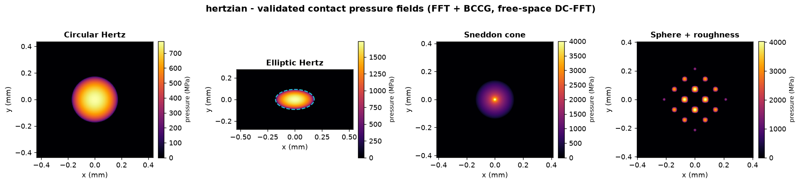
</p>

<p align="center"><sub>コアが現在解く4つの接触問題を、収束した接触圧力場として示しています。いずれも自由空間 DC-FFT と Polonsky–Keer BCCG で解き、各ケースを解析解と照合済みです。並列比較による検証は<a href="#ギャラリー--可視化">ギャラリー</a>を参照してください。</sub></p>

> **状態：P0–P4 完了（Draft 0.1）。**
> Rust コアは、ゼロパディング自由空間 DC-FFT と Polonsky–Keer BCCG ソルバで、
> 円形（球–平面 / 球–球）および楕円（トーラス外赤道上の球）の Hertz 接触を解きます。
> いずれも解析解で検証済みです。P4 では**任意の高さ場形状と加算的な粗さ**（任意の
> `Gap` ＋粗さ層）に対応しました。検証は、Sneddon の非 Hertz コーン、独立に実装した
> 密行列・射影 Gauss–Seidel ソルバ、そして閉形式を持たない粗面接触については外部コード
> [Tamaas](https://gitlab.com/tamaas/tamaas) を自由空間演算子で動かして行っています。
> **Python バインディング**（PyO3 + `maturin`、ゼロコピー NumPy、ソルブ中は GIL 解放、
> CPython 3.11+ 向けの単一 `abi3` ホイール）がソルバを公開し、ベンチマークを Python から
> 再現できます。周期境界とマルチボディ接触は、今後の課題として残っています。

---

## 概要

二つの弾性体の**法線・無摩擦接触**を解くソルバです。両者を**弾性半空間**で近似し、
接触界面を**共通平面上の一様格子**で離散化します。圧力分布 $p$ と表面変位 $u$ の関係は
**畳み込み** $u = K * p$ になり、畳み込み定理により **FFT** で
$O(N^2) \to O(N\log N)$ に高速化できます：

$$u = K * p \qquad \overset{\text{FFT}}{\Longrightarrow} \qquad \hat{u} = \hat{K}\cdot\hat{p}$$

非貫入・非引張の拘束 $\bigl(p \ge 0,\ g \ge 0,\ p\,g = 0\bigr)$ は **Polonsky–Keer 型の
制約付き共役勾配法（BCCG）** で解きます。自由空間（非周期）の Hertz 接触を正しく
扱うため、**ゼロパディング DC-FFT** を用います。

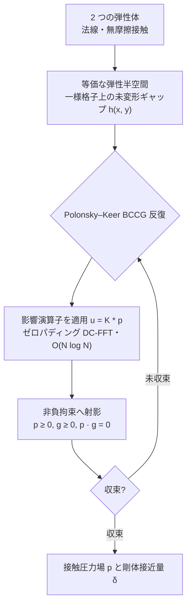

各反復のコストは影響演算子の適用 $u = K * p$ に集約され、これがゼロパディング DC-FFT で
$O(N\log N)$ に下がります。単純に FFT を使うと*巡回*畳み込みになり、これは接触が周期的に
並んだ状態に相当するため、孤立した Hertz 接触には合いません。そこで圧力とカーネルをともに
格子の 2 倍にゼロパディングし、カーネルをラップアラウンド順に並べます。こうすると巡回
畳み込みが、元の領域上では*線形*（自由空間）の畳み込みと一致します：

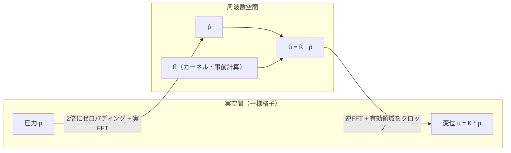

> 一様格子は**欠かせません**。非一様格子では畳み込みの構造が崩れ、FFT による
> 高速化も成り立たなくなるからです。

### 設計方針

単一の接触をとにかく速く解くことよりも、**任意形状・表面粗さ・マルチボディ接触**へ
広げられることを優先しています。

### 検証ロードマップ

1. **円形接触** — 球–平面 / 球–球。解析的な Hertz 解で検証します。
2. **楕円接触** — トーラス外軌道上の球（凸–凸）。非軸対称の計算経路をひととおり動かします。
3. **任意の高さ場形状と粗さ** — 半空間近似の範囲で、格子上に与えた任意のギャップに
   加算的な粗さ層を重ねます。Sneddon のコーン（解析解・非 Hertz）、独立な密行列ソルバ、
   Tamaas と相互検証します（後述の[相互検証](#相互検証)を参照）。

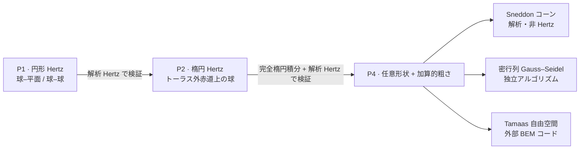

### v1 のスコープ外

摩擦・接線接触、弾塑性・粘弾性、コーティング、凝着（JKR/Maugis）、強保形接触、
GPU 実行。いずれも v1 では実装しません。ただし、後から差し込めるよう、アーキテクチャ側に
トレイト境界だけは用意してあります。

### 先行研究

近いライブラリのなかで最も成熟しているのは [Tamaas](https://gitlab.com/tamaas/tamaas)
（EPFL、C++/Python、FFTW + OpenMP）ですが、こちらは既定で周期境界を前提とします。本
プロジェクトは、ネイティブな `pip` ホイールとして配布できる Rust + PyO3 実装である点が
異なります。なお Tamaas は非周期の演算子も備えており、P4 ではこれを自由空間の相互検証の
基準として使います（[相互検証](#相互検証)を参照）。

---

## 技術スタック

| レイヤ              | ツール                                                         |
| ------------------- | ------------------------------------------------------------- |
| 数値コア            | Rust — `ndarray`, `rustfft` / `realfft`, `rayon`              |
| Python バインディング | `PyO3` + `maturin` + `rust-numpy`（ゼロコピー NumPy 連携）      |
| Python 環境 / 開発   | [`uv`](https://docs.astral.sh/uv/)（必須。生の Python は使えません） |
| 静的解析            | `ruff`（lint+format）、`mypy --strict`、`clippy -D warnings`    |

ソルバは**関数的なコア / 命令的なシェル**という構成で、ジオメトリ（`Gap`）と弾性応答
（`InfluenceOperator`）はトレイト境界の裏に隠してあります。新しい形状やカーネル
（周期・層状など）は、ソルバ本体に手を入れず、impl を 1 つ追加するだけで差し込めます。

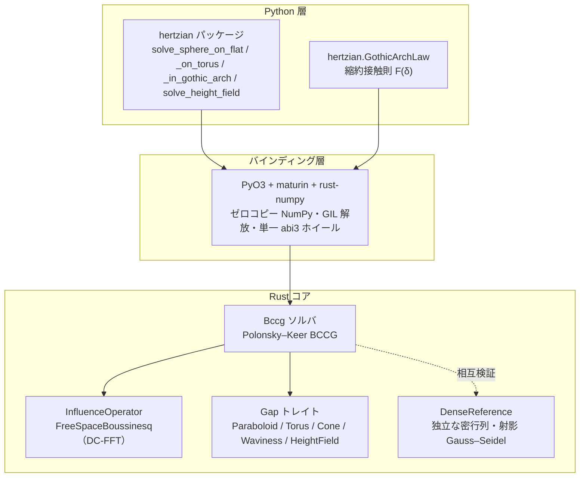

---

## 使い方（Python）

```python
import numpy as np
import hertzian

# 解析解による簡易版：円形 Hertz（平面上の球）。`domain` は界面格子（原点中心の
# 正方形）の物理的な一辺の長さ（メートル）。
sol = hertzian.solve_sphere_on_flat(
    radius=10e-3, load=50.0, e_star=70e9, grid=(256, 256), domain=1.2e-3
)
print(sol.contact_radius, sol.max_pressure, sol.approach)
print(sol.diagnostics)            # 反復回数、残差、収束フラグ
pressure = sol.pressure           # (nx, ny) float64 NumPy 配列（軸 0 = x）

# 楕円 Hertz：トーラス外赤道上の球（凸–凸、P2）。
sol = hertzian.solve_sphere_on_torus(
    sphere_radius=12e-3, tube_radius=4e-3, centre_radius=20e-3,
    load=60.0, e_star=100e9, grid=(256, 256), domain=1.2e-3,
)
print(sol.contact_half_widths, sol.ellipticity)

# 応用例：ゴシックアーチ（尖頭）軸受溝に押し込まれた玉。2つの円弧（2トーラス）を
# 重ねた形で、保形度は r/Rs = 1.04。centre_offset を非ゼロにする（円弧中心のシム）と
# 玉は2つのフランクに乗り、接触が2つに分裂する。centre_offset=0 なら単一の保形楕円
# 接触に戻る。ドメインは分裂方向（子午線 y 軸）に沿って縦長にとる。
sol = hertzian.solve_sphere_in_gothic_arch(
    sphere_radius=4e-3, tube_radius=4.16e-3, centre_radius=15e-3,
    centre_offset=65e-6, load=800.0, e_star=100e9,
    grid=(96, 846), domain=(0.65e-3, 5.74e-3),
)
print(sol.max_pressure)  # 2つのフランクパッチ、各々 P/2 での楕円 Hertz 接触

# 汎用エントリポイント（P4）：任意の未変形ギャップ高さ場 h(x, y)。形状は自由で、
# 必要なら粗さを上乗せできる。中心揃えの一様格子上でギャップを組み立て、ソルバへ渡す。
nx, ny = 256, 256
dx = dy = 1.2e-3 / nx
x = (np.arange(nx) - (nx - 1) / 2) * dx
y = (np.arange(ny) - (ny - 1) / 2) * dy
sphere = (x[:, None] ** 2 + y[None, :] ** 2) / (2 * 10e-3)          # 滑らかなベース
roughness = (                                                       # 加算的なうねり
    0.2e-6
    * np.cos(2 * np.pi * x[:, None] / 1e-4)
    * np.cos(2 * np.pi * y[None, :] / 1e-4)
)
sol = hertzian.solve_height_field(
    gap=np.ascontiguousarray(sphere + roughness), load=50.0, e_star=70e9, dx=dx, dy=dy
)
print(sol.contact_area, sol.max_pressure)
```

`e_star` は等価弾性係数 $E^*$ で、$\dfrac{1}{E^*} = \dfrac{1-\nu_1^2}{E_1} + \dfrac{1-\nu_2^2}{E_2}$
です。ソルバは GIL を解放して動くので、Python のスレッド間で並列に呼び出せます。
v1 では自由空間境界だけを実装しています。`boundary="periodic"` は名前だけ予約してあり、
呼ぶと `NotImplementedError` を送出します。

---

## ギャラリー / 可視化

ソルバが**現在解いている問題**を、収束した**圧力場**と、それを裏づける**解析解**の
両方で示します。各図は左が圧力場、右が解析解との比較です。滑らかな Hertz 接触は
閉じた形と、コーンは Sneddon の閉形式と、粗い接触は滑らかな基準に対する**接触の分裂と
ピーク圧の上昇**で、それぞれ確かめられます。右側の閉形式は Rust コアとは独立に
[`scripts/render_gallery.py`](./scripts/render_gallery.py) で導き直しているので、各パネルは
ソルバが自分自身ではなく基準解に一致していることを示しています。

### 円形 Hertz — 平面上の球（P1）

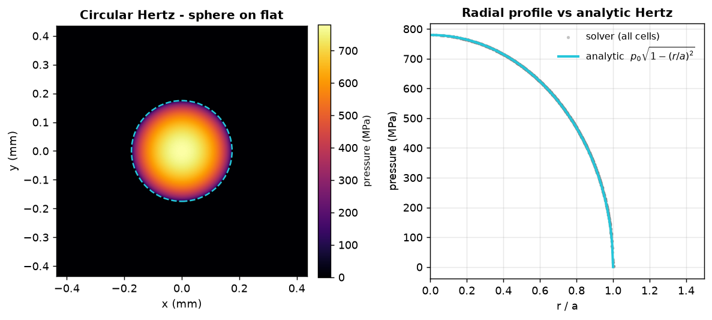

軸対称のベンチマークです。圧力場（左）は解析的な接触円（破線）を満たします。**全**格子
セルの圧力を $r/a$ に対してプロットすると（右）、場全体が Hertz 楕円体に重なります：

$$p(r) = p_0\sqrt{1 - (r/a)^2}$$

ここでは $a \approx 0.175\,\mathrm{mm}$、$p_0 \approx 780\,\mathrm{MPa}$ で、解析解と約 0.2 % で一致します。

### 楕円 Hertz — トーラス外赤道上の球（P2）

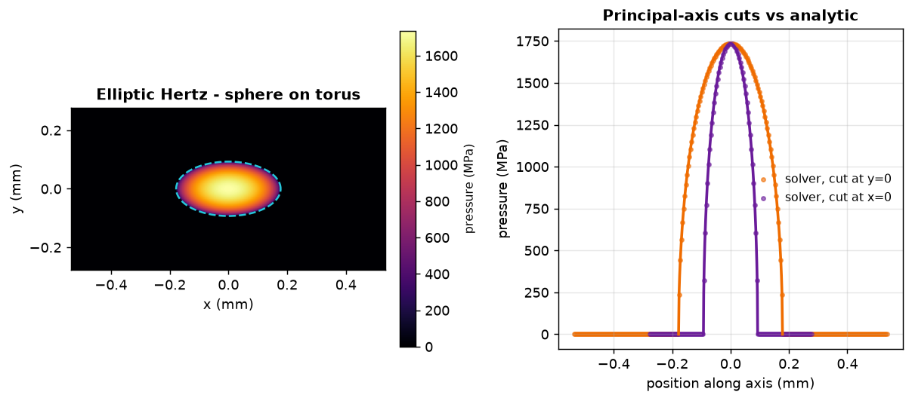

凸–凸の接触は楕円になります。周方向（$x$）が子午線方向（$y$）より長くなります。求まった
接触域は解析的な接触楕円（破線、$a_x/a_y \approx 1.92$）をなぞり、各主軸に沿った断面は
解析的な半楕円体プロファイルに乗ります：

$$p(x, y) = p_0\sqrt{1 - (x/a_x)^2 - (y/a_y)^2}, \qquad p_0 \approx 1.74\,\mathrm{GPa}.$$

離心率 $e$ は、完全楕円積分 $K(e),\ E(e)$ で解いた超越的な曲率関係
$\dfrac{E/(1-e^2) - K}{K - E} = \dfrac{R_x}{R_y}$ から決まります。

### Sneddon のコーン — 非 Hertz・尖点特異の圧子（P4）

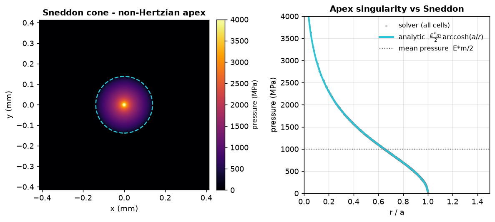

**任意**（非放物面）のギャップ $h = m\,r$ を、測定した表面と同じ「高さ場」の経路で処理します。
Hertz と違って圧力は尖点で対数的に発散するので、（メッシュ依存の）ピークそのものは比較
**しません**。ただし半径方向プロファイルは Sneddon の閉形式に従います：

$$a = \sqrt{\frac{2P}{\pi E^* m}}, \qquad \delta = \frac{\pi}{2}\,m\,a, \qquad p(r) = \frac{E^* m}{2}\operatorname{arccosh}\!\frac{a}{r}.$$

接触半径 $a \approx 0.138\,\mathrm{mm}$ は閉形式と約 0.2 % 以内で一致します。

### 粗面接触 — 球＋粗さ、分裂（P4）

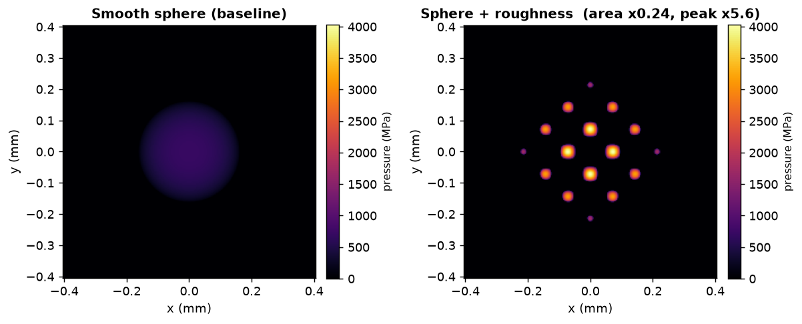

滑らかな球に余弦状の粗さ $h_r = A\cos(2\pi x/\lambda_x)\cos(2\pi y/\lambda_y)$ を重ねる
（単純な高さ場の足し算）と、単一の Hertz 円板が**突起接触**の格子へと分裂します。*同じ*
荷重のもとで、実接触面積は滑らかな円板の約 ¼ に減り、ピーク圧は約 5.6 倍に上がります。
これは粗面接触に特有の現れ方です。粗いパッチは閉形式を持たないので、独立な密行列ソルバ
および Tamaas と相互検証します（次節）。

> ギャラリーは `make gallery`（または
> `uv run --with matplotlib python scripts/render_gallery.py`）で再生成します。matplotlib は
> 描画のためだけに使う依存です。後述の Tamaas 相互検証と同じく、その更新がコアの
> パイプラインを壊さないよう、ロック環境からは意図的に外しています。

---

## 応用例 — ゴシックアーチ軸受溝

ボールベアリングの軌道溝は、単一の円弧ではなく**中心をずらした2つの円弧**（＝2トーラスを
重ねた凹面）として研削されることが多く、先のとがった**ゴシックアーチ**形になります。
玉は溝の底ではなく**2つのフランクに乗り**、接触は2点に**分裂**します。これは新しいソルバ
機能ではなく、検証済みの**楕円接触（基本要素）の応用**にあたり、$r/R_s = 1.04$（玉径に
対して溝半径が 52 % という教科書的な保形度）の保形接触です。

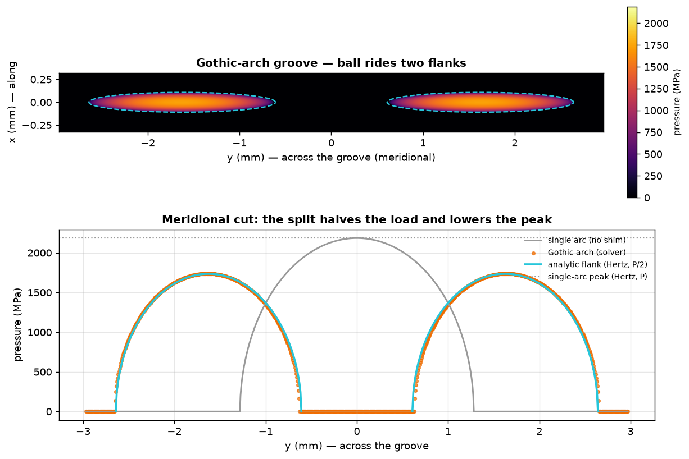

溝のギャップは二重井戸型になります。中心をずらした2つの楕円放物面のうち、玉に最も近い面が
各点で選ばれます（点ごとの最小）：

$$h(x, y) = \frac{x^2}{2 R_x} + \frac{(|y| - y_0)^2}{2 R_y}.$$

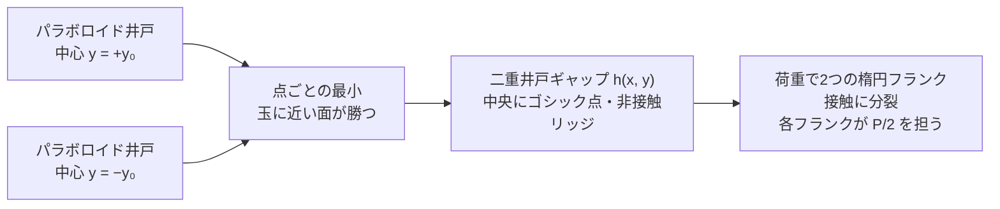

子午線半径は**保形**で $R_y = \dfrac{1}{1/R_s - 1/r}$（凹溝）、周方向半径は凸で
$R_x = \dfrac{1}{1/R_s + 1/R_0}$、フランクオフセットは
$y_0 = \texttt{centre\_offset}\cdot\dfrac{R_s}{r - R_s}$ です。円弧中心のわずかなシムは
保形度によって**約 25 倍に拡大**され、65 µm のシムでフランクが ±1.6 mm 離れます。
*同じ*全荷重でも、単一アーチ（$\texttt{centre\_offset} = 0$）は1つの楕円パッチになりますが、
ゴシックのシムはそれを2つに分裂させます。

この分裂は**荷重を保存し、それ自体が検証にもなっています**。各フランクは荷重の**半分**を担う楕円 Hertz
接触なので、そのピークは **P2 ベンチマークと同じ閉形式**に乗ります。ここでは
$p_0 \approx 1.74\,\mathrm{GPa}$ で、楕円 Hertz のギャラリーパネルと一致し、単一アーチのピーク
（$\approx 2.19\,\mathrm{GPa}$）のちょうど $(1/2)^{1/3} \approx 0.79$ 倍です。$y = 0$ のゴシック点は
荷重を担いません。上の数値（$R_s = 4\,\mathrm{mm}$、$r = 4.16\,\mathrm{mm}$、
$R_0 = 15\,\mathrm{mm}$、$E^* = 100\,\mathrm{GPa}$、$P = 800\,\mathrm{N}$）は、フランク圧が
ギャラリーの GPa 域に収まるよう選んだものです。$P/2$ での楕円 Hertz と各フランクが
等価であること、および非接触のリッジは、Rust のシナリオテストと Python バインディング
テストで固定しています。

### シムの調整 — 半分だけ重なる2つのフランク

同じ溝のまま**シムを詰める**と、2つのフランク接触は離れたままではなく、**接触楕円が
半分ずつ重なり合う**ところまで近づきます。設計上のねらいは、子午線方向のフランク
オフセットを $y_0 = b/2$ にすることです（$b$ は半荷重の孤立フランク楕円の子午線半軸）。
半軸 $b$ の2つの楕円の中心が $b$ だけ離れていれば、互いに**半分ずつ**を共有します。重なりが
**ゴシック点を埋める**ので、接触は一続き（連結）になります。これは分離アーチの非接触
リッジとは対照的です。$|y|$ の折り返しはそのままなので、**左右対称**も保たれます。

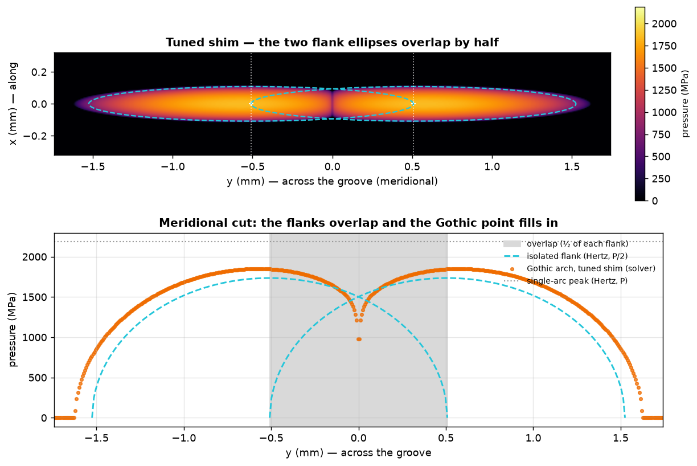

重なり領域には**閉形式がありません**。2つのフランクは弾性場を通じて**相互作用**し、荷重は
もはやきれいに $P/2$ ずつには分かれないからです。重なりはピーク圧を、分離時の $(1/2)^{1/3}$ 倍の値より
**押し上げ**ますが、単一アーチ（$y_0 = 0$）のピークより**下**に留まります（ここでは
$\approx 1.85\,\mathrm{GPa}$、分離フランクの $1.74\,\mathrm{GPa}$ と単一アーチの
$2.19\,\mathrm{GPa}$ の間）。$20\,\mu\mathrm{m}$ のシムで $y_0 \approx 0.51\,\mathrm{mm}$ に
なります。解析的な基準がないので、検証は **P4 方式**、すなわち同じ格子上の独立な密行列・射影
Gauss–Seidel 参照解との相互検証で行います。重なりに特有の現れ（**連結**して荷重を担うゴシック
点と、**サドル**でつながる左右対称の2フランク）は、Rust のシナリオテストと Python
バインディングテストで固定しています。

---

## 縮約接触則 — マルチボディ動力学のための軽量 `F(δ)`

単一の滑らかな Hertz 接触は、$F = k\,\delta^{3/2}$ と力の向き $\mathbf{e}\parallel(\mathbf{x}-\mathbf{o})$
という**2入力2出力**の代数式で表せます。しかしゴシックアーチ溝のように玉が**2つのフランク**に
乗る複雑な形状では、もはや単一の代数式には収まりません。とはいえマルチボディ動力学の
ような繰り返し計算では、毎ステップ FFT ソルバを回す余裕はありません。そこで検証済みの
場のソルバを**軽量な力則 $F(\delta)$** に落とし込み、形状に合わせて**回帰でフィッティング**します。

### モデル

溝の子午断面で、玉中心の変位 $\boldsymbol{\delta} = (\delta_t, \delta_n)$（横断 $\hat{t}$ ・
法線 $\hat{n}$）が、接触半角 $\pm\alpha$ だけ傾いた2つのフランク法線
$\hat{n}_\pm = (\pm\sin\alpha,\ \cos\alpha)$ 方向に各フランクを押し込みます。各フランクは
（引張なし＝正の部分 $\lfloor\cdot\rfloor_+$ のみ）Hertz 荷重を担い、合力はそのベクトル和です：

$$
\begin{aligned}
s_\pm &= \boldsymbol{\delta}\cdot\hat{n}_\pm = \delta_n\cos\alpha \pm \delta_t\sin\alpha, \\[2pt]
Q_\pm &= K\,\lfloor s_\pm\rfloor_+^{3/2}, \\[4pt]
F(\boldsymbol{\delta}) &= Q_+\,\hat{n}_+ + Q_-\,\hat{n}_-
  \;\Longrightarrow\;
  F_t = (Q_+ - Q_-)\sin\alpha,\quad
  F_n = (Q_+ + Q_-)\cos\alpha.
\end{aligned}
$$

上から順に、各フランクの**接近量** $s_\pm$（フランク法線 $\hat{n}_\pm$ への射影）、各フランクの
**Hertz 荷重** $Q_\pm$、そして合力 $F$ とその横断・法線成分 $(F_t, F_n)$ です。
$K$ は1フランクの楕円 Hertz 荷重–変位定数、$\alpha$ は幾何学的な接触角（ここでは
$\alpha \approx 24^\circ$）です。これは単一 Hertz 接触の $F = k\,\delta^{3/2}$ を2フランクに
重ね合わせた、2入力2出力の閉形式そのものです。

### 境界条件 — 2溝→1溝の微分連続（`C¹`）

荷重が傾くと内側フランクが除荷し、$\delta_t = \delta_n\cot\alpha$ で**離れ**ます。接触は
**2フランクから1フランク**へ移り、力則は単一 Hertz 接触 $F = K\,s_+^{3/2}\,\hat{n}_+$
（先に示した1溝の $F = k\,\delta^{3/2}$、$\mathbf{e}\parallel(\mathbf{x}-\mathbf{o})$）に
帰着します。


**この遷移は `C¹`** です。力**と**そのヤコビアン（接線剛性）がともに連続になります。理由は
Hertz 指数が $3/2 > 1$ だからです。除荷するフランクは荷重**も**剛性**も**ゼロで噛み合うため、
$Q_- \propto s_-^{3/2}\to 0$ かつ $\mathrm{d}Q_-/\mathrm{d}s_- \propto s_-^{1/2}\to 0$。
**1.5乗こそが、2→1 のなめらかな受け渡しを保証する構造**です。ただし `C²` ではありません。
接線剛性は $\sqrt{\ \cdot\ }$ のカスプ（$\mathrm{d}^2Q/\mathrm{d}s^2 \propto s^{-1/2}\to\infty$）を
持ちます。これは Hertz 接触が無限の初期勾配で硬化するという、おなじみの特徴です。

解析的な接線剛性（カップリングを切った $\kappa = 0$ の形）は、各フランクの接線
$g_\pm = \tfrac{3}{2}K\,\lfloor s_\pm\rfloor_+^{1/2}$ を用いて

$$
\frac{\mathrm{d}F}{\mathrm{d}\boldsymbol{\delta}} =
\begin{bmatrix}
(g_+ + g_-)\sin^2\alpha & (g_+ - g_-)\sin\alpha\cos\alpha \\
(g_+ - g_-)\sin\alpha\cos\alpha & (g_+ + g_-)\cos^2\alpha
\end{bmatrix}
$$

となります。フランクが除荷すると $g_\pm\to 0$ になるので、行列は離反の境目を越えても連続
（＝`C¹`）です。一方その微分は $g_\pm\propto\sqrt{s_\pm}$ で発散するので、`C²` ではありません。

### 隣のフランクが相手を持ち上げる — 一次の弾性カップリング

2フランクを**独立**な Hertz 接触として重ね合わせるのが厳密になるのは、両者が十分に離れているときだけ
です。分離極限では各フランクが半荷重を担い、有効フランク数 $\eta = P/(K\,\delta^{3/2})$ は
$2$ になります。シムを詰めて2つのフランク接触が近づくと弾性場が重なり、**一方のフランクの荷重
$Q$ が、もう一方の真下の半空間を持ち上げ**て、隣の接近量、ひいては荷重を削ります。一次の
近似では、各フランクは相手の Boussinesq 遠方場、すなわち距離 $d = 2 y_0$（フランク中心は
$y = \pm y_0$）にある点荷重 $Q$ を受けます：

$$u \approx \frac{Q}{\pi E^* d}, \qquad d = 2 y_0.$$

そこで2つの**実効**接近量は、互いの荷重を通じて連立します：

$$s_\pm^{\text{eff}} = s_\pm - \kappa\,Q_\mp, \qquad Q_\pm = K\,\lfloor s_\pm^{\text{eff}}\rfloor_+^{3/2}, \qquad \kappa = \frac{1}{2\pi E^* y_0}.$$

小さな $2\times 2$ の自己無撞着な解（`with_flank_coupling` で有効化）です。閉形式の安さも、
解析ヤコビアンも、`C¹` もそのままです。除荷するフランクは荷重**も**剛性**も**持ち上げ**も**ゼロで
噛み合い、$y_0 \to \infty$ では $\kappa \to 0$ となって分離極限（$\eta = 2$）に戻ります。これは縮約則の
適用範囲を「十分に分離」から「半重なり」まで広げる、検証済みの基本要素への**一次の相互作用項**です。

このリフトは**大きさ**の補正で、フランクの接近量（`coupled_loads`）の段階で効きます。その
ため荷重分割 $P_+ : P_-$（＝力がどちらのフランクにどう分かれるか）まで含めて決まります。一方、
向きにはもう一段細かい**二次**の効果が残ります。重なると各フランクは隣の**内側**をより強く
持ち上げるので、荷重
重心が幾何オフセット $y_0$ の**外側**へずれます（場ソルバでは半重なりで $y_0$ の約 36 % 外、
分離すれば $y_0$ に戻る）。これはフランク**法線の回転**、すなわちより急な実効接触角
$\alpha_\text{eff}(y_0/b) = \arcsin(y_c / R_s)$（荷重重心 $y_c$、分離側で $\alpha$ に戻る）にあたり、
その実効角で法則を組めば取り込めます。ただしこれは $(F_t, F_n)$ の射影だけを直すもので、本節で検証する
$\eta$ や分割には効きません。そのため、完全合体（$\eta \to 1$、単一アーチへのなめらかな接続）と
あわせて次の段階に回します。重心が外側へずれることは `gothic_overlap_shifts_the_load_centroid_outboard` で固定しています。

### 横から見た断面 — 球・2トーラス・荷重ベクトルで見るカップリング

ここまでの図は、接触**面**を上から見たもの（圧力場と子午線断面）でした。下図は**横から見た
断面**です。もとになる形状は、**球**（玉）が**2つのトーラス**（管半径 $r$ の2円弧）に挟まれた
溝です。これに**荷重ベクトル**を重ね、**厳密解**（FFT+BCCG 場ソルバ）と**近似解**（縮約則）を
並べます。シムを開くにつれて1つの楕円接触が2つの傾いたフランクに分かれ、一次カップリングが
有効フランク数 $\eta = P/(K\,\delta^{3/2})$ を単純計算の $2$ から引き下げる様子を、3つの状態で
示します。


各パネルの上段が**横から見た断面**、下段がその**子午線圧力断面**（厳密＝ソルバ、近似＝解析 Hertz）です。
荷重ベクトルは、2つのフランク反力 $Q_\pm = P/(2\cos\alpha)$ がフランク法線 $\hat{n}_\pm$ を向き、その
鉛直成分の和が外部荷重 $P$ に釣り合うことを示します。

- **(a) 単一アーチ — 1つの楕円。** シムがないと2円弧は一致し、接触は全荷重を担う単一の楕円
  Hertz パッチになります。荷重ベクトルはまっすぐ上向き（$\alpha = 0$）で $\eta = 1$ です。ソルバの
  ピーク（$\approx 2.18\,\mathrm{GPa}$）は解析 Hertz（全荷重）と **0.1 % 以内**で一致します。
- **(b) 半重なり — その中間。** $y_0 = b/2$ までシムを開くと、2つのフランク楕円が半分
  重なります。接触が近づいて弾性場が重なり、各フランクが相手の真下を持ち上げるため、$\eta$ は
  単純計算の $2$ から**大きく下がります**（ソルバ $1.44$）。一次のカップリング則は、その落ち込みの
  ほとんどを $1.54$ まで取り戻します（残差は ~7 %、点荷重近似が最も弱い最深部）。子午線断面では、
  ソルバの連結したピークが半荷重フランクの半楕円**より上**を走ります。これが重なりによる補強です。
- **(c) 分離2フランク — 左右対称。** さらにシムを開くと（ギャラリーの 65 µm 溝、
  $\alpha \approx 24^\circ$）、明確に分離した左右対称の2フランク接触になります。カップリングは
  薄れ、$\eta \to {\sim}2$ に近づきます（ソルバ $1.83$、カップリング $1.84$）。ソルバのピークは
  半荷重 Hertz の半楕円に乗ります。

管半径は保形に近く（$r/R_s = 1.04$）、実寸では2円弧がミクロン単位で重なって見分けられません。
そのため断面では、管半径を**模式的に拡大**して2つのトーラスを離して描いています（接触角 $\alpha$
と接触位置 $\pm y_0$ は厳密値です）。図は `make gallery`（または
`uv run --with matplotlib python scripts/render_coupling_cross_section.py`）で再生成します。

### フィッティングと検証

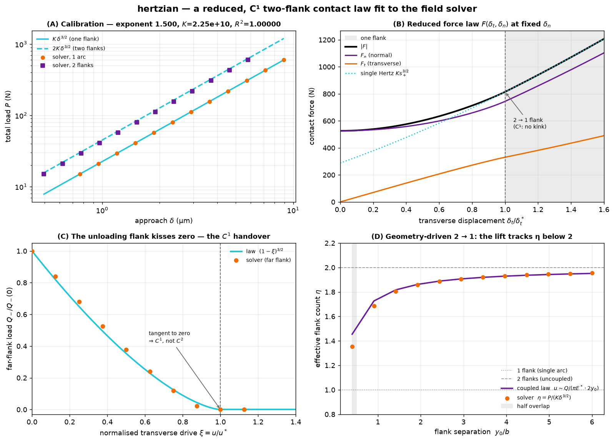

$K$ は単一アーチの荷重スイープから較正します。勾配を自由にした回帰が Hertz 指数 **1.500**
（理論値 1.5）と $K = P/\delta^{3/2}$ を **$R^2 = 1.000000$** で復元し（パネルA、解析 $K$ と
**0.2 %** 一致）、2フランクの点は $2K$ の線に重なって**重ね合わせ**が確認できます。パネルB は
較正済みの $F(\delta_t, \delta_n)$ を横断方向にスイープしたもので、離れの先で単一 Hertz の漸近線に
なめらかに乗る様子（`C¹`）を示します。パネルC は、除荷フランクが普遍曲線 $Q_-/Q_-(0) = (1-\xi)^{3/2}$ に従って
**接線的にゼロへ**近づく様子です。ソルバの非対称な井戸の実験のマーカーが（**3 %** 以内で）その上に
乗ります。**3/2乗がそのまま `C¹` を生む**わけです。パネルD は、シムを詰めると有効フランク数
$\eta = P/(K\,\delta^{3/2})$ が **1.95**（分離した2フランク）から半重なりに向けて 2 を割り込む様子です。
**隣のフランクが相手を持ち上げる一次カップリング**（紫線、$u \sim Q/(\pi E^*\cdot 2 y_0)$）が
$\eta = 2$ からのずれをほぼ埋め、ソルバ点（橙）を半重なり域まで追従します。大きさ（$\eta$）の
一致は、半重なりで**数 %**以内、分離側で **1 % 未満**です。向き（荷重分割 $P_+ : P_-$）も、重なりの
入口で数 % 以内に再現します。最も詰めた半重なりでは点荷重近似が最も弱く、残差は ~7 % まで開きます。
ここから完全合体（$\eta \to 1$）までは、単一アーチを起点にしたなめらかな接続として次の段階に分けます。
$\eta$ と分割は Rust のシナリオテスト（`gothic_coupling_tracks_the_effective_flank_count`、
`gothic_coupling_captures_the_load_split`）で固定しています。

これは新しいソルバ機能ではなく、**検証済みの基本要素を凝縮したもの**です。閉形式の $F(\delta)$ は
FFT を一切呼ばず、`powf` 数回で評価できるので、マルチボディの内側ループに直接置けます。Rust
コア（`hertzian::GothicArchLaw`、解析ヤコビアン付き）と Python バインディング
（`hertzian.GothicArchLaw`）の両方で公開し、`C¹` と Hertz 極限、そしてソルバとの一致を
Rust／Python テストで固定しています。図は `make gallery`（または
`uv run --with matplotlib python scripts/fit_reduced_law.py`）で再生成します。

```python
import hertzian

# フランク形状から法則を一度だけ較正する（実行時に FFT ソルブなし）。
law = hertzian.GothicArchLaw.from_elliptic_flank(
    radius_x=3.31e-3,  # 1フランクの周方向の相対半径
    radius_y=0.104,  # 子午線方向の（保形）相対半径
    e_star=100e9,
    contact_angle=hertzian.contact_half_angle(offset=1.6e-3, ball_radius=4e-3),
)

# 半重なりまで使うなら、隣のフランクの持ち上げ（一次カップリング）を有効化する：
law = law.with_flank_coupling(e_star=100e9, offset=1.6e-3)  # κ = 1/(2π E* y0)

# あとはマルチボディの内側ループで F(δ) と接線剛性を評価する：
f_t, f_n = law.force(2e-6, 6e-6)  # 接触力ベクトル (N)
stiffness = law.jacobian(2e-6, 6e-6)  # 2x2 接線剛性 dF/dδ (N/m)

# クーロン摩擦には合力 F だけでなく面圧分布が要る：各フランクの（カップリング後の）
# 荷重から、楕円 Hertz 半楕円体のキャップ p(x, y) を立方根スケールで得る（FFT 不要）。
q_plus, q_minus = law.flank_loads(2e-6, 6e-6)  # カップリング込みのフランク荷重 (N)
cap = law.flank_pressure(q_plus)  # 1フランク分の面圧分布
p0 = cap.peak_pressure  # ピーク圧 p0 = 3Q/(2π a_x a_y) (Pa)
tau_max = cap.traction_bound(0.12, 0.0, 0.0)  # 局所クーロンキャップ μ p(x, y) (Pa)

# 両フランクをまとめた溝全体のキャップは、2つの半楕円体の「包絡」＝点ごとの最大
# （素朴な和ではない）。重なっても継ぎ目を二重計上せず、分離時は和と一致する。
groove = law.groove_pressure(q_plus, q_minus, offset=1.6e-3)  # 溝全体の面圧キャップ
tau_groove = groove.traction_bound(0.12, 0.0, 0.0)  # 局所クーロンキャップ μ p(x, y)
```

### 面圧分布 — クーロン摩擦のための軽量キャップ

ここまでの $F(\boldsymbol{\delta})$ は**合力**です。しかしクーロン摩擦は局所的で、接線トラクションは
各点で面圧によって $|\tau(x,y)| \le \mu\,p(x,y)$ と上限を課されます。つまり合力だけでは足りず、
**面圧分布** $p(x,y)$ そのものが必要です。各フランクは（カップリング後の）荷重 $Q_\pm$ を担う楕円
Hertz 接触なので、その面圧はおなじみの半楕円体になります。これを各フランク中心 $\pm y_0$ に置きます：

$$
p(x,y) = p_0\sqrt{\left\lfloor 1 - \Bigl(\tfrac{x}{a_x}\Bigr)^2 - \Bigl(\tfrac{y\mp y_0}{a_y}\Bigr)^2\right\rfloor_+},
\qquad |\tau(x,y)| \le \mu\,p(x,y).
$$

形状は**一度だけ**、$K$ を較正したのと同じフランクから決まります。Hertz の荷重スケール則で
接触半軸は $a = \hat{a}\,Q^{1/3}$ なので、ピーク圧も立方根でスケールします：

$$
p_0 = \frac{3Q}{2\pi a_x a_y} = c_p\,Q^{1/3},\qquad c_p = \frac{3}{2\pi\,\hat{a}_x \hat{a}_y},
$$

`flank_pressure(Q)` は `cbrt` 数回で済み、内側ループに離心率の超越方程式は出てきません。$Q = K\,s^{3/2}$
なので $p_0 = c_p K^{1/3}\sqrt{s}$、つまり面圧の上限は離反点で $\sqrt{s}$ としてゼロに**接して**消えます。力を `C¹` に
する 1.5 乗の特徴が、ここにも現れます。半楕円体は $Q$ ちょうどに積分される（$\iint p\,\mathrm{d}A = Q$）ので、
全滑り時の摩擦合力は1フランクあたり $\iint \mu\,p\,\mathrm{d}A = \mu Q$ になります。

**両フランクの合成 — 和ではなく包絡。** 1フランクのキャップは、フランクが分離していれば厳密です。
しかし**溝全体のキャップ**——マルチボディ接触が要るのは両フランクをまとめたもの——を、2つの半楕円体の
**単純な和**で作ると、重なりで破綻します。
足し算が正しいのは2つの footprint が**重ならない**間（分離領域、各点でせいぜい一方のフランクだけが接触）
だけです。シムを詰めて半分重なると、和は重なりを**二重計上**し、継ぎ目を非物理的なスパイクに積み上げます。

正しい軽量合成は点ごとの**最大**——**包絡**——で、これは溝ギャップの作り方のちょうど**双対**です。ギャップは
2つのフランク井戸の点ごとの**最小** $h = \min(\text{well}_+, \text{well}_-)$（近い面が勝つ、`GothicArchProfile`）。
対応して面圧キャップは2つの footprint の点ごとの最大、各点で**より深く押された**フランクが面圧を決めます：

$$
p(x,y) = \max\!\bigl(p_+(x,\, y - y_0),\ p_-(x,\, y + y_0)\bigr).
$$

`groove_pressure(...)` がこの $p(x,y)$ を返します（`GrooveContactPressure`）。footprint が分離している
ところでは包絡は和と**完全に一致**し（分離領域の検証はそのまま）、重なるところでは二重計上を落として、
場ソルバの**サドルでつながった連結パッチ**を取り戻します（包絡のピークは $\max(p_{0+}, p_{0-})$。各フランクの
面圧は自分のピークを超えないからです）。**半分重なる**ところ（$y_0 = b/2$）が、まさに本タスクの比較点です。
**厳密解（場ソルバ）と軽量式を並べると**、素朴な和はピークを **約 +68 %** 過大評価する（継ぎ目のスパイク）一方、
包絡は **−4 %**——厳密解にほぼ乗り、サドルも再現します。

これは一次のキャップです。包絡は重なりレンズ $\iint \min(p_+, p_-)$ を捨てるので、重なるところでは積分が
$Q_+ + Q_-$ をわずかに下回ります（各フランク荷重そのものは厳密なので、全滑り合力は荷重から
$\mu (Q_+ + Q_-)$ のまま）。このレンズを配り直すこと——単一アーチへの単一パッチ合体（合体すれば1つの接触が
$2Q$ を担い、より深いピーク $c_p (2Q)^{1/3}$ になる）——は、$\eta \to 1$ のブレンドと**同じ次の段階**です。


ピーク圧スケール $p_0 = c_p Q^{1/3}$ を単一アーチの荷重スイープに固定すると、ソルバと理論線は
**0.998** で一致します（パネルA、立方根スケールの散らばりはゼロ）。本タスクの題材である**半重なり**
（$y_0 = b/2$）の子午線断面では、**厳密解（ソルバ、橙）と軽量式**を直接並べます（パネルB）。素朴な和は
継ぎ目を**約 +68 %** のスパイクに積み上げますが、**包絡 $\max(p_+, p_-)$** はソルバに **−4 %** で乗り、
連結したサドルを再現します。パネルCは分離溝の2次元クーロンキャップ $\mu p(x,y)$ で、接線モデルが下に
収まるべき2つの楕円の接触域を、ソルバの接触縁とともに描きます。パネルDはシムを詰めたときのピーク圧で、
分離側 $y_0/b \ge 1$ では和も包絡もソルバに一致し（和のピーク誤差 0.1 %）、重なり側では**素朴な和が過大評価**
する一方、**包絡はソルバを全域で追います**（スイープ全体でピーク誤差 $\le 7\,\%$）。包絡が捨てる重なりレンズの
配り直し——単一パッチへの完全合体（$\eta \to 1$、単一アーチへのなめらかな接続）——は**次の段階**に回します。

包絡が分離時に和と一致すること、半重なりでソルバを数 % で追うこと、$p_0$ の立方根スケールと半楕円体の
積分の一致は、Rust のシナリオテスト（`gothic_flank_pressure_caps_the_field_solver`、
`gothic_groove_pressure_envelope_caps_the_overlap`）と Rust／Python のユニットテストで固定しています。
図は `make gallery`（または
`uv run --with matplotlib python scripts/render_pressure_distribution.py`）で再生成します。

---

## 相互検証

滑らかな Hertz 接触は閉形式と照合できますが、任意形状、とくに**粗面**接触には、解析的な
基準がありません。P4 ではこれらを、独立した3つの方法で検証します：

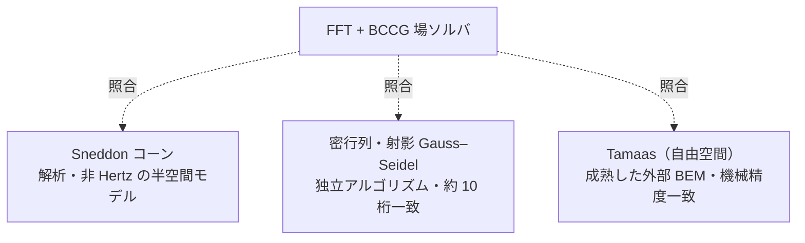

| 検証 | 何を固定するか | 場所 |
| ----- | ------------ | ----- |
| **Sneddon のコーン** | 非 Hertz・尖点特異の形状に対する半空間*モデル*（厳密な接触半径 / 接近量 / 荷重） | `cone_on_flat`, `SneddonCone`（Rust）；`test_cone_matches_sneddon`（Python） |
| **密行列・射影 Gauss–Seidel** | *反復ソルバ*そのもの。同じカーネル上を無関係なアルゴリズムで解き、分裂した粗いパッチで約10桁一致 | `DenseReference`（Rust）；`rough_sphere_cross_validates_against_the_dense_reference` |
| **Tamaas（自由空間）** | *実装*そのもの。成熟した外部 [Tamaas](https://gitlab.com/tamaas/tamaas) 境界要素コードを非周期演算子で動かし、滑らか・粗いギャップともに機械精度で一致 | `tests/test_cross_validation.py` |

連続体 **FEM** と比べれば、半空間モデルが対象外とする領域（有限厚さや保形形状）まで
踏み込めます。`InfluenceOperator` と `Gap` のトレイト境界はそれを差し込む余地を残しており、
一方で上で挙げた厳密弾性論の解析基準は、宣言したスコープの範囲ですでにモデルを固定しています。

Tamaas は検証のときだけ使うオプションの依存です。その更新がコアのパイプラインを壊さないよう、
ロック済みのプロジェクト環境からは意図的に外しています。比較は次のコマンドで実行します：

```sh
uv run --with tamaas pytest tests/test_cross_validation.py
```

---

## 開発

### 前提環境

- [`uv`](https://docs.astral.sh/uv/getting-started/installation/) — **本プロジェクトで
  Python を動かす、唯一サポートされた方法**です（後述の*生の Python 禁止*を参照）。
- `rustup` で入れる Rust ツールチェイン。正確なバージョン（`clippy` と `rustfmt` を含む）は
  [`rust-toolchain.toml`](./rust-toolchain.toml) に固定してあり、最初に `cargo` や
  `rustup show` を実行したときに自動でインストールされます。

### クイックスタート

```sh
make setup    # uv sync ＋ git フック ＋ Rust ツールチェインをインストール
make build    # ネイティブ拡張を uv venv にビルド（maturin develop）
make test     # cargo test ＋ pytest
make lint     # CI と全く同じ静的解析をすべて実行（pre-commit）
make fmt      # Python（ruff）と Rust（cargo fmt）を自動整形
make help     # 全ターゲットを一覧表示
```

> `make` は単に便利のためのラッパです。正式なチェックは
> [`.pre-commit-config.yaml`](./.pre-commit-config.yaml) にあり、CI も同じフックを実行します。
> つまり `make lint` がローカルで通れば、CI の静的解析ジョブも通ります。

### 生の Python 禁止

本プロジェクトでは **Python の直接呼び出しを禁止**しています（`python …`、`pip …`、
`requirements.txt`、`setup.py`、conda など）。すべて `uv` を経由します：

```sh
uv run python ...     # ✅ `python ...` の代わり
uv run pytest         # ✅
uv add <pkg>          # ✅ `pip install <pkg>` の代わり
uvx <tool>            # ✅ 単発のツール
```

このルールは [`scripts/check-no-raw-python.sh`](./scripts/check-no-raw-python.sh) によって
強制され、pre-commit と CI で実行されます。背景と詳しい理由は
[`CONTRIBUTING.md`](./CONTRIBUTING.md) にあります。

---

## ライセンス

[MIT](./LICENSE-MIT) または [Apache-2.0](./LICENSE-APACHE) のいずれかを選択できる
デュアルライセンスです。
