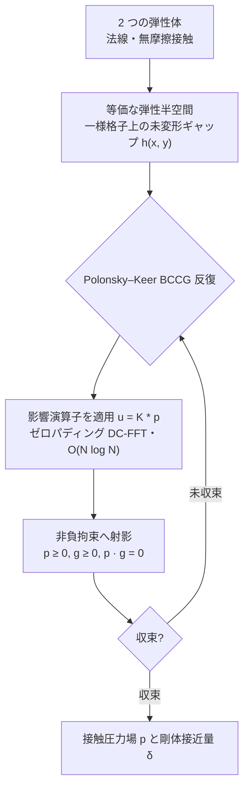
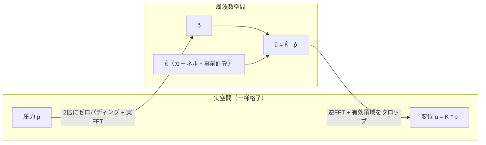
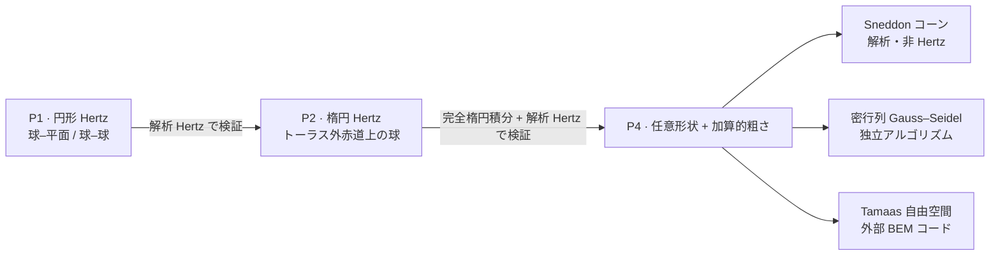
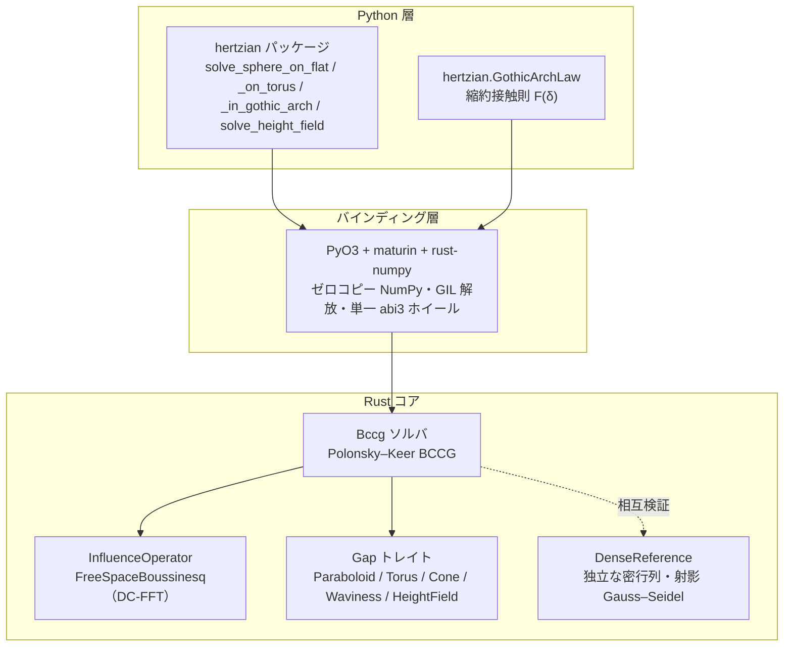
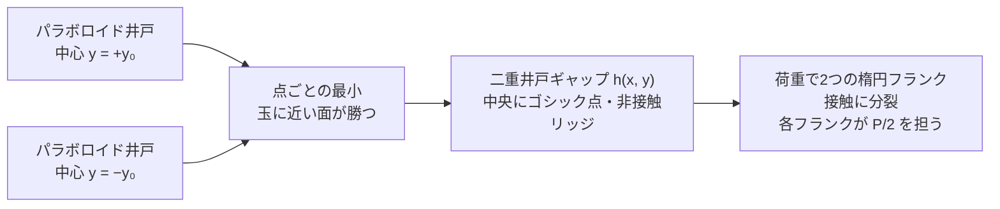

# hertzian

**弾性半空間の法線接触を FFT で高速に解くソルバ。Rust コア + PyO3 バインディング。**

<p align="center">
  
</p>

<p align="center"><sub>コアが扱う4つの接触問題を、収束した接触圧力場として示す。いずれも自由空間 DC-FFT と Polonsky–Keer BCCG で解いたものである。図は<a href="#ギャラリー--可視化">ギャラリー</a>に、解析解との照合は<a href="docs/verification.md">検証ドキュメント</a>にまとめた。</sub></p>

> **状態：P0–P4 完了（Draft 0.1）。**
> Rust コアは、ゼロパディング自由空間 DC-FFT と Polonsky–Keer BCCG ソルバにより、
> 円形（球–平面 / 球–球）と楕円（トーラス外赤道上の球）の Hertz 接触、および任意形状と
> 加算的な粗さ（任意の `Gap` に粗さ層を重ねたもの、P4）を解く。結果はすべて解析解か
> 外部コードと照合済みである（[検証ドキュメント](docs/verification.md)）。Python バインディングは
> ソルバをそのまま公開し、ベンチマークを Python から再現できる（PyO3 と `maturin`、
> ゼロコピー NumPy、ソルブ中は GIL を解放、CPython 3.11+ 向けの単一 `abi3` ホイール）。
> 周期境界とマルチボディ接触は今後の課題とする。

---

## 概要

二つの弾性体の法線・無摩擦接触を解くソルバである。両者を弾性半空間で近似し、接触界面を
共通平面上の一様格子で離散化する。圧力分布 $`p`$ と表面変位 $`u`$ の関係は畳み込み
$`u = K * p`$ となり、畳み込み定理により FFT で $`O(N^2) \to O(N\log N)`$ に
高速化できる：

$$u = K * p \qquad \overset{\text{FFT}}{\Longrightarrow} \qquad \hat{u} = \hat{K}\cdot\hat{p}$$

非貫入・非引張の拘束 $`\bigl(p \ge 0,\ g \ge 0,\ p\,g = 0\bigr)`$ は、Polonsky–Keer 型の
制約付き共役勾配法（BCCG）で解く。自由空間（非周期）の Hertz 接触を正しく
扱うため、ゼロパディング DC-FFT を用いる。



各反復のコストは影響演算子の適用 $`u = K * p`$ に集中し、これがゼロパディング DC-FFT で
$`O(N\log N)`$ に下がる。単純に FFT を用いると巡回畳み込みとなるが、これは接触が
周期的に並んだ状態に相当し、孤立した Hertz 接触には適合しない。そこで、圧力とカーネルを
どちらも格子の 2 倍にゼロパディングし、カーネルをラップアラウンドの順に並べる。これにより、
巡回畳み込みは元の領域上で線形（自由空間）の畳み込みと一致する：



> 一様格子は不可欠である。非一様格子では畳み込みの構造が崩れ、FFT による
> 高速化も成立しない。

### 設計方針

単一接触を最速で解くことよりも、任意形状や表面粗さ、マルチボディ接触へ
拡張できることを優先する。

### 検証ロードマップ

ソルバは、解析解を持つ問題から順に積み上げる。一致の度合いや検証方法の詳細は
[検証ドキュメント](docs/verification.md)にまとめた。

1. **円形接触**（球–平面 / 球–球）。解析的な Hertz 解で検証する。
2. **楕円接触**（トーラス外赤道上の球、凸–凸）。非軸対称の計算経路を確認する。
3. **任意の高さ場形状と粗さ**。半空間近似の範囲で、格子上に与えた任意のギャップに
   加算的な粗さ層を重ねる。Sneddon のコーン（解析解・非 Hertz）、独立な密行列ソルバ、
   Tamaas と相互検証する。



### v1 のスコープ外

摩擦・接線接触、弾塑性・粘弾性、コーティング、凝着（JKR/Maugis）、強保形接触、
GPU 実行。これらは v1 では実装しない。ただし、後から差し込めるよう、アーキテクチャ側に
トレイト境界のみ用意してある。

### 先行研究

近いライブラリのうち最も成熟しているのは [Tamaas](https://gitlab.com/tamaas/tamaas)
（EPFL、C++/Python、FFTW + OpenMP）だが、これは既定で周期境界を前提とする。本
プロジェクトは、ネイティブな `pip` ホイールとして配布できる Rust + PyO3 実装である点が
異なる。なお Tamaas は非周期の演算子も備えるため、P4 ではこれを自由空間での相互検証の
基準とする（[検証ドキュメント](docs/verification.md#相互検証)を参照）。

---

## 技術スタック

| レイヤ              | ツール                                                         |
| ------------------- | ------------------------------------------------------------- |
| 数値コア            | Rust — `ndarray`, `rustfft` / `realfft`, `rayon`              |
| Python バインディング | `PyO3` + `maturin` + `rust-numpy`（ゼロコピー NumPy 連携）      |
| Python 環境 / 開発   | [`uv`](https://docs.astral.sh/uv/)（必須。生の Python は使用不可） |
| 静的解析            | `ruff`（lint+format）、`mypy --strict`、`clippy -D warnings`    |

ソルバは「関数的なコアと命令的なシェル」という構成をとり、ジオメトリ（`Gap`）と弾性応答
（`InfluenceOperator`）はトレイト境界の裏に隠す。新しい形状やカーネル
（周期・層状など）は、ソルバ本体に手を入れず、impl を 1 つ追加するだけで差し込める。



---

## 使い方（Python）

```python
import numpy as np
import hertzian

# 解析解による簡易版：円形 Hertz（平面上の球）。`domain` は界面格子（原点中心の
# 正方形）の物理的な一辺の長さ（メートル）。
sol = hertzian.solve_sphere_on_flat(
    radius=10e-3, load=50.0, e_star=70e9, grid=(256, 256), domain=1.2e-3
)
print(sol.contact_radius, sol.max_pressure, sol.approach)
print(sol.diagnostics)            # 反復回数、残差、収束フラグ
pressure = sol.pressure           # (nx, ny) float64 NumPy 配列（軸 0 = x）

# 楕円 Hertz：トーラス外赤道上の球（凸–凸、P2）。
sol = hertzian.solve_sphere_on_torus(
    sphere_radius=12e-3, tube_radius=4e-3, centre_radius=20e-3,
    load=60.0, e_star=100e9, grid=(256, 256), domain=1.2e-3,
)
print(sol.contact_half_widths, sol.ellipticity)

# 応用例：ゴシックアーチ（尖頭）軸受溝に押し込まれた玉。2つの円弧（2トーラス）を
# 重ねた形で、保形度は r/Rs = 1.04。centre_offset を非ゼロにする（円弧中心のシム）と
# 玉は2つのフランクに乗り、接触が2つに分裂する。centre_offset=0 なら単一の保形楕円
# 接触に戻る。ドメインは分裂方向（子午線 y 軸）に沿って縦長にとる。
sol = hertzian.solve_sphere_in_gothic_arch(
    sphere_radius=4e-3, tube_radius=4.16e-3, centre_radius=15e-3,
    centre_offset=65e-6, load=800.0, e_star=100e9,
    grid=(96, 846), domain=(0.65e-3, 5.74e-3),
)
print(sol.max_pressure)  # 2つのフランクパッチ、各々 P/2 での楕円 Hertz 接触

# 汎用エントリポイント（P4）：任意の未変形ギャップ高さ場 h(x, y)。形状は自由で、
# 必要なら粗さを上乗せできる。中心揃えの一様格子上でギャップを組み立て、ソルバへ渡す。
nx, ny = 256, 256
dx = dy = 1.2e-3 / nx
x = (np.arange(nx) - (nx - 1) / 2) * dx
y = (np.arange(ny) - (ny - 1) / 2) * dy
sphere = (x[:, None] ** 2 + y[None, :] ** 2) / (2 * 10e-3)          # 滑らかなベース
roughness = (                                                       # 加算的なうねり
    0.2e-6
    * np.cos(2 * np.pi * x[:, None] / 1e-4)
    * np.cos(2 * np.pi * y[None, :] / 1e-4)
)
sol = hertzian.solve_height_field(
    gap=np.ascontiguousarray(sphere + roughness), load=50.0, e_star=70e9, dx=dx, dy=dy
)
print(sol.contact_area, sol.max_pressure)
```

`e_star` は等価弾性係数 $`E^*`$ であり、$`\dfrac{1}{E^*} = \dfrac{1-\nu_1^2}{E_1} + \dfrac{1-\nu_2^2}{E_2}`$
で定義する。ソルバは GIL を解放して動作するため、Python のスレッドから並列に呼び出せる。
v1 で実装しているのは自由空間境界のみである。`boundary="periodic"` は名前だけ予約してあり、
呼ぶと `NotImplementedError` を送出する。

---

## ギャラリー / 可視化

ソルバが扱う問題を、収束した圧力場で示す。各図は、左が圧力場、右が
解析解との比較である。定量的な一致（一致率や検証方法）は
[検証ドキュメント](docs/verification.md)にまとめた。

### 円形 Hertz — 平面上の球（P1）


軸対称のベンチマークである。圧力場（左）は解析的な接触円（破線）を満たす。すべての格子
セルの圧力を $`r/a`$ に対してプロットすると（右）、場全体が Hertz 楕円体に重なる：

$$p(r) = p_0\sqrt{1 - (r/a)^2}$$

### 楕円 Hertz — トーラス外赤道上の球（P2）


凸–凸の接触は楕円となり、周方向（$`x`$）が子午線方向（$`y`$）より長くなる。求まった
接触域は解析的な接触楕円（破線）をなぞり、各主軸に沿った断面は解析的な半楕円体プロファイルに
乗る：

$$p(x, y) = p_0\sqrt{1 - (x/a_x)^2 - (y/a_y)^2}$$

離心率 $`e`$ は、完全楕円積分 $`K(e),\ E(e)`$ で解いた曲率関係
$`\dfrac{E/(1-e^2) - K}{K - E} = \dfrac{R_x}{R_y}`$ から定まる。

### Sneddon のコーン — 非 Hertz・尖点特異の圧子（P4）


任意（非放物面）のギャップ $`h = m\,r`$ を、測定した表面と同じ「高さ場」の経路で処理する。
Hertz と異なり、圧力は尖点で対数的に発散する。半径方向のプロファイルは Sneddon の閉形式に
従う：

$$a = \sqrt{\frac{2P}{\pi E^* m}}, \qquad \delta = \frac{\pi}{2}\,m\,a, \qquad p(r) = \frac{E^* m}{2}\operatorname{arccosh}\!\frac{a}{r}.$$

### 粗面接触 — 球＋粗さ、分裂（P4）


滑らかな球に余弦状の粗さ $`h_r = A\cos(2\pi x/\lambda_x)\cos(2\pi y/\lambda_y)`$ を重ねる
（高さ場の足し算）と、単一の Hertz 円板が突起接触の格子へと分裂する。同じ荷重の
もとでも実接触面積は減り、ピーク圧は上がる。これは粗面接触に特有の挙動である。粗い
パッチは閉形式を持たないため、独立な密行列ソルバと Tamaas で相互検証する
（[検証ドキュメント](docs/verification.md#相互検証)）。

> ギャラリーは `make gallery`（または
> `uv run --with matplotlib python scripts/render_gallery.py`）で再生成する。matplotlib は
> 描画のためだけに使う依存であり、ロック環境からは意図的に外してある。

---

## 応用例 — ゴシックアーチ軸受溝

ボールベアリングの軌道溝は、単一の円弧ではなく、中心をずらした2つの円弧（2トーラスを
重ねた凹面）として研削されることが多く、先のとがったゴシックアーチ形となる。
玉は溝の底ではなく2つのフランクに乗り、接触は2点に分裂する。これは新しいソルバ
機能ではなく、検証済みの楕円接触（基本要素）の応用であり、$`r/R_s = 1.04`$（玉径に
対して溝半径が 52 % という教科書的な保形度）の保形接触である。


溝のギャップは二重井戸型となる。中心をずらした2つの楕円放物面のうち、各点で玉に最も
近い面が選ばれる（点ごとの最小）：

$$h(x, y) = \frac{x^2}{2 R_x} + \frac{(|y| - y_0)^2}{2 R_y}.$$



子午線半径は保形で $`R_y = \dfrac{1}{1/R_s - 1/r}`$（凹溝）、周方向半径は凸で
$`R_x = \dfrac{1}{1/R_s + 1/R_0}`$、フランクオフセットは
$`y_0 = \texttt{centre\_offset}\cdot\dfrac{R_s}{r - R_s}`$ である。円弧中心のわずかなシムは
保形度によって約 25 倍に拡大され、65 µm のシムでフランクが ±1.6 mm 離れる。
同じ全荷重でも、単一アーチ（$`\texttt{centre\_offset} = 0`$）なら1つの楕円パッチとなるが、
ゴシックのシムはこれを2つに分裂させる。

この分裂は荷重を保存するため、それ自体が検証にもなる。各フランクは荷重の半分を担う
楕円 Hertz 接触であり、そのピークは P2 ベンチマークと同じ閉形式に乗る。具体的な
一致は[検証ドキュメント](docs/verification.md#ゴシックアーチ溝の検証)にまとめた。

### シムの調整 — 半分だけ重なる2つのフランク

同じ溝のままシムを詰めると、2つのフランク接触は離れたままではなく、接触楕円が
半分ずつ重なり合うところまで近づく。設計上のねらいは、子午線方向のフランク
オフセットを $`y_0 = b/2`$ とすることにある（$`b`$ は半荷重の孤立フランク楕円の子午線半軸）。
半軸 $`b`$ の2つの楕円は、中心が $`b`$ だけ離れていれば互いに半分ずつを共有する。重なりが
ゴシック点を埋めるため、接触は一続き（連結）となる。これは、分離したアーチの非接触
リッジとは対照的である。$`|y|`$ の折り返しはそのままなので、左右対称も保たれる。


重なり領域には閉形式がない。2つのフランクが弾性場を通じて相互作用し、荷重が
厳密には $`P/2`$ ずつには分かれないためである。解析的な基準がないため、検証は P4 方式、
すなわち同じ格子上の独立な密行列・射影 Gauss–Seidel 参照解との相互検証で行う
（[検証ドキュメント](docs/verification.md#半分重なるフランクの検証)）。

---

## 縮約接触則 — マルチボディ動力学のための軽量 `F(δ)`

単一の滑らかな Hertz 接触は、$`F = k\,\delta^{3/2}`$ と力の向き $`\mathbf{e}\parallel(\mathbf{x}-\mathbf{o})`$
という2入力2出力の代数式で表せる。しかし、ゴシックアーチ溝のように玉が2つのフランクに
乗る複雑な形状では、単一の代数式には収まらない。一方、マルチボディ動力学の
ような繰り返し計算では、毎ステップ FFT ソルバを回す余裕はない。そこで、検証済みの
場のソルバを軽量な力則 $`F(\delta)`$ に落とし込み、形状に合わせて回帰でフィッティングする。

### モデル

溝の子午断面では、玉中心の変位 $`\boldsymbol{\delta} = (\delta_t, \delta_n)`$（横断 $`\hat{t}`$・
法線 $`\hat{n}`$）が、接触半角 $`\pm\alpha`$ だけ傾いた2つのフランク法線
$`\hat{n}_\pm = (\pm\sin\alpha,\ \cos\alpha)`$ の方向に各フランクを押し込む。各フランクは
Hertz 荷重を担い（引張は受けないため正の部分 $`\lfloor\cdot\rfloor_+`$ のみ）、合力はその
ベクトル和となる：

$$
\begin{aligned}
s_\pm &= \boldsymbol{\delta}\cdot\hat{n}_\pm = \delta_n\cos\alpha \pm \delta_t\sin\alpha, \\[2pt]
Q_\pm &= K\,\lfloor s_\pm\rfloor_+^{3/2}, \\[4pt]
F(\boldsymbol{\delta}) &= Q_+\,\hat{n}_+ + Q_-\,\hat{n}_-
  \;\Longrightarrow\;
  F_t = (Q_+ - Q_-)\sin\alpha,\quad
  F_n = (Q_+ + Q_-)\cos\alpha.
\end{aligned}
$$

式は上から順に、各フランクの接近量 $`s_\pm`$（フランク法線 $`\hat{n}_\pm`$ への射影）、各フランクの
Hertz 荷重 $`Q_\pm`$、そして合力 $`F`$ とその横断・法線成分 $`(F_t, F_n)`$ である。
$`K`$ は1フランクの楕円 Hertz 荷重–変位定数、$`\alpha`$ は幾何学的な接触角（ここでは
$`\alpha \approx 24^\circ`$）である。これは、単一 Hertz 接触の $`F = k\,\delta^{3/2}`$ を2フランクに
重ね合わせた、2入力2出力の閉形式である。

### 境界条件 — 2溝→1溝の微分連続（`C¹`）

荷重が傾くと内側フランクが除荷し、$`\delta_t = \delta_n\cot\alpha`$ で離れる。接触は
2フランクから1フランクへ移り、力則は単一 Hertz 接触 $`F = K\,s_+^{3/2}\,\hat{n}_+`$
（先に示した1溝の $`F = k\,\delta^{3/2}`$、$`\mathbf{e}\parallel(\mathbf{x}-\mathbf{o})`$）に
帰着する。


この遷移は `C¹` である。力とそのヤコビアン（接線剛性）がいずれも連続となる。Hertz
指数が $`3/2 > 1`$ だからである。除荷するフランクは、荷重も剛性もゼロのまま
なめらかに合流する。$`Q_- \propto s_-^{3/2}\to 0`$ かつ $`\mathrm{d}Q_-/\mathrm{d}s_- \propto s_-^{1/2}\to 0`$
となるためである。この 1.5 乗が、2→1 のなめらかな切り替えを保証する。ただし `C²` では
ない。接線剛性は $`\sqrt{\ \cdot\ }`$ のカスプ（$`\mathrm{d}^2Q/\mathrm{d}s^2 \propto s^{-1/2}\to\infty`$）を
持つ。これは、Hertz 接触が無限の初期勾配で硬化するという特徴である。

解析的な接線剛性（カップリングを切った $`\kappa = 0`$ の形）は、各フランクの接線
$`g_\pm = \tfrac{3}{2}K\,\lfloor s_\pm\rfloor_+^{1/2}`$ を使って

$$
\frac{\mathrm{d}F}{\mathrm{d}\boldsymbol{\delta}} =
\begin{bmatrix}
(g_+ + g_-)\sin^2\alpha & (g_+ - g_-)\sin\alpha\cos\alpha \\
(g_+ - g_-)\sin\alpha\cos\alpha & (g_+ + g_-)\cos^2\alpha
\end{bmatrix}
$$

となる。フランクが除荷すると $`g_\pm\to 0`$ となるため、行列は離反の境目を越えても連続である
（すなわち `C¹`）。一方その微分は $`g_\pm\propto\sqrt{s_\pm}`$ で発散するため、`C²` ではない。

### 隣のフランクが相手を持ち上げる — 一次の弾性カップリング

2フランクを独立な Hertz 接触として重ね合わせる近似が厳密となるのは、両者が十分に離れている
ときに限る。分離極限では各フランクが半荷重を担い、有効フランク数 $`\eta = P/(K\,\delta^{3/2})`$ は
$`2`$ となる。シムを詰めて2つのフランク接触が近づくと弾性場が重なり、一方のフランクの荷重
$`Q`$ がもう一方の真下の半空間を持ち上げ、隣の接近量、ひいては荷重を削る。一次の
近似では、各フランクは相手の Boussinesq 遠方場、すなわち距離 $`d = 2 y_0`$
（フランク中心は $`y = \pm y_0`$）にある点荷重 $`Q`$ を受ける：

$$u \approx \frac{Q}{\pi E^* d}, \qquad d = 2 y_0.$$

したがって、2つの実効接近量は互いの荷重を通じて連立する：

$$s_\pm^{\text{eff}} = s_\pm - \kappa\,Q_\mp, \qquad Q_\pm = K\,\lfloor s_\pm^{\text{eff}}\rfloor_+^{3/2}, \qquad \kappa = \frac{1}{2\pi E^* y_0}.$$

小さな $`2\times 2`$ の自己無撞着な解である（`with_flank_coupling` で有効化）。閉形式の安さも、
解析ヤコビアンも、`C¹` もそのまま保たれる。除荷するフランクは荷重も剛性も持ち上げも
ゼロのまま合流し、$`y_0 \to \infty`$ では $`\kappa \to 0`$ となり分離極限（$`\eta = 2`$）に戻る。
これは検証済みの基本要素に一次の相互作用項を加えたものであり、縮約則の適用範囲を
「十分に分離」から「半重なり」まで広げる。

このリフトは荷重の大きさの補正であり、フランクの接近量（`coupled_loads`）の段階で効く。
向きについては、もう一段細かい二次の効果が残る。重なると荷重重心が幾何オフセット $`y_0`$ の
外側へずれ、フランク法線がわずかに回転する効果である。ただしこれは $`(F_t, F_n)`$ の射影のみを
補正するもので、本節で扱う $`\eta`$ や荷重分割には影響しない。そのため、完全合体（$`\eta \to 1`$、
単一アーチへのなめらかな接続）とあわせて次の段階に回す。

横から見た断面で厳密解（場ソルバ）と近似解（縮約則）を3つの状態で並べた図と、$`\eta`$ の
較正・一致の数値は、[検証ドキュメント](docs/verification.md#縮約接触則の較正と検証)に
まとめた。

```python
import hertzian

# フランク形状から法則を一度だけ較正する（実行時に FFT ソルブなし）。
law = hertzian.GothicArchLaw.from_elliptic_flank(
    radius_x=3.31e-3,  # 1フランクの周方向の相対半径
    radius_y=0.104,  # 子午線方向の（保形）相対半径
    e_star=100e9,
    contact_angle=hertzian.contact_half_angle(offset=1.6e-3, ball_radius=4e-3),
)

# 半重なりまで使うなら、隣のフランクの持ち上げ（一次カップリング）を有効化する：
law = law.with_flank_coupling(e_star=100e9, offset=1.6e-3)  # κ = 1/(2π E* y0)

# あとはマルチボディの内側ループで F(δ) と接線剛性を評価する：
f_t, f_n = law.force(2e-6, 6e-6)  # 接触力ベクトル (N)
stiffness = law.jacobian(2e-6, 6e-6)  # 2x2 接線剛性 dF/dδ (N/m)

# クーロン摩擦には合力 F だけでなく面圧分布が要る：各フランクの（カップリング後の）
# 荷重から、楕円 Hertz 半楕円体のキャップ p(x, y) を立方根スケールで得る（FFT 不要）。
q_plus, q_minus = law.flank_loads(2e-6, 6e-6)  # カップリング込みのフランク荷重 (N)
cap = law.flank_pressure(q_plus)  # 1フランク分の面圧分布
p0 = cap.peak_pressure  # ピーク圧 p0 = 3Q/(2π a_x a_y) (Pa)
tau_max = cap.traction_bound(0.12, 0.0, 0.0)  # 局所クーロンキャップ μ p(x, y) (Pa)

# 両フランクをまとめた溝全体のキャップは、2つの半楕円体の「包絡」＝点ごとの最大
# （素朴な和ではない）。重なっても継ぎ目を二重計上せず、分離時は和と一致する。
groove = law.groove_pressure(q_plus, q_minus, offset=1.6e-3)  # 溝全体の面圧キャップ
tau_groove = groove.traction_bound(0.12, 0.0, 0.0)  # 局所クーロンキャップ μ p(x, y)

# 離散クーロン摩擦ソルバには、点ごとの値ではなく「格子メッシュの各セル中心＋そのセルが
# 担う法線荷重（面圧の積分）」が要る。pressure_mesh(nx, ny) が footprint の bounding box を
# nx×ny セルで切り、その一式をまとめて返す（FlankPressure / GrooveContactPressure 共通）。
mesh = groove.pressure_mesh(nx=64, ny=96)  # PressureMesh
mesh.x, mesh.y  # セル中心座標 (m)：x は (nx,)、y は (ny,)
mesh.force  # セルごとの法線荷重 ΔP = p·ΔA (N)、形状 (nx, ny)。総和 ≈ 接触荷重
mesh.total_force  # ΔP の総和 (N)。分離時は Q_+ + Q_- に一致、重なり時はレンズ分だけ下回る
tau_cell = 0.12 * mesh.force  # 各セルのクーロン摩擦上限 μ ΔP (N)。総和は全滑り合力 μ ΣΔP
```

### 較正パイプライン — 形状から係数を自動取得する（`calibrate`）

上の例では、フランクの相対半径・オフセット・接触角を手で求めて法則に渡していた。
`hertzian.calibrate` は、この還元を自動化する。Rust 側は係数 $`(K, \alpha, \kappa)`$ を後から
差し込むだけの純粋関数 $`F(\delta)`$ であり、Python 側のパイプラインが物理形状（玉・溝・基準中心の
各半径、アーチのシム、弾性係数）から係数を導いて差し込む。数行で、すぐ使える法則が
得られる：

```python
import hertzian

# 物理的な溝の仕様（SI 単位）を一度書くだけ。
spec = hertzian.GrooveSpec(
    ball_radius=4.0e-3,  # 玉半径 R_s
    tube_radius=4.16e-3,  # 溝（チューブ）半径 r （r/R_s = 1.04）
    centre_radius=15.0e-3,  # 基準中心円半径 R_0
    centre_offset=65.0e-6,  # アーチのシム（微小オフセット）
    e_star=100e9,  # 等価弾性係数 E*
)

cal = hertzian.calibrate(spec)  # 形状 → 係数（既定で場ソルバ検証つき）
law = cal.law  # すぐ使える GothicArchLaw
f_t, f_n = law.force(1e-6, 6e-6)  # マルチボディ内側ループでそのまま評価
print(cal.describe())  # 係数・精度・速度の確認レポート
```

`calibrate` は既定で、蒸留元である FFT+BCCG 場ソルバに対して結果を自己検証する。単一アーチの
荷重スイープで Hertz の 1.5 乗則と剛性 $`K`$ を確認し、二フランクの一点で結合後の有効フランク数 $`\eta`$ を
照合し、力評価の速度を測る。`describe()` は、それを一目で読める形にまとめる：

```text
hertzian: reduced Gothic-arch law calibration
================================================
groove (input):
  R_s   (ball)      = 4.0000e-03 m
  r     (tube)      = 4.1600e-03 m   (r/R_s = 1.040)
  ...
reduced flank (derived):
  R_x  (circumf.)   = 3.1579e-03 m
  R_y  (meridional) = 1.0400e-01 m
  y0   (flank off.) = 1.6250e-03 m
  alpha (contact)   = 23.97 deg
coefficients (inserted into the Rust law):
  K     (stiffness) = 2.24314e+10 N/m^1.5
  kappa (coupling)  = 9.79415e-10 m/N
verification (FFT+BCCG field solver):
  exponent m        = 1.5000   (Hertz 1.5)
  fit R^2           = 1.000000
  K (solver fit)    = 2.24695e+10 N/m^1.5  (x1.002 vs analytic)
  max load residual = 0.17 %
  eta (flank count) = 1.919 solver / 1.920 law  (0.1 %)
speed:
  field solve       = ~350 ms
  reduced force()   = ~0.9 µs
  speed-up          = ~4e+05 x
```

ここで、精度（指数 1.5、$`R^2 \approx 1`$、残差 0.2 % 未満、$`\eta`$ の一致 0.1 %）と速度（場ソルバ比で
約 10⁵ 倍）の両立が確認できる。ソルブを走らせず解析係数だけを得たい場合は、
`hertzian.calibrate(spec, verify=False)` とする（`cal.verification` は `None` となる）。実行可能な一式は
`scripts/calibrate_gothic_law.py` にあり、`uv run python scripts/calibrate_gothic_law.py` で動作する。

### 面圧分布 — クーロン摩擦のための軽量キャップ

ここまでの $`F(\boldsymbol{\delta})`$ は合力である。しかしクーロン摩擦は局所的で、接線トラクションは
各点で面圧により $`|\tau(x,y)| \le \mu\,p(x,y)`$ と上限を課される。すなわち、合力だけでは足りず、
面圧分布 $`p(x,y)`$ そのものが必要となる。各フランクは（カップリング後の）荷重 $`Q_\pm`$ を担う楕円
Hertz 接触であり、その面圧は半楕円体となる。これを各フランク中心 $`\pm y_0`$ に置く：

$$
p(x,y) = p_0\sqrt{\left\lfloor 1 - \Bigl(\tfrac{x}{a_x}\Bigr)^2 - \Bigl(\tfrac{y\mp y_0}{a_y}\Bigr)^2\right\rfloor_+},
\qquad |\tau(x,y)| \le \mu\,p(x,y).
$$

形状は一度だけ、$`K`$ を較正したのと同じフランクから定まる。Hertz の荷重スケール則で
接触半軸は $`a = \hat{a}\,Q^{1/3}`$ となるため、ピーク圧も立方根でスケールする：

$$
p_0 = \frac{3Q}{2\pi a_x a_y} = c_p\,Q^{1/3},\qquad c_p = \frac{3}{2\pi\,\hat{a}_x \hat{a}_y},
$$

`flank_pressure(Q)` は `cbrt` 数回で済み、内側ループに離心率の超越方程式は現れない。$`Q = K\,s^{3/2}`$
より $`p_0 = c_p K^{1/3}\sqrt{s}`$ となり、面圧の上限は離反点で $`\sqrt{s}`$ としてゼロに接しながら消える。力を `C¹` に
する 1.5 乗の特徴が、ここにも現れる。半楕円体は $`Q`$ ちょうどに積分される（$`\iint p\,\mathrm{d}A = Q`$）ため、
全滑り時の摩擦合力は1フランクあたり $`\iint \mu\,p\,\mathrm{d}A = \mu Q`$ となる。

**両フランクの合成は、和ではなく包絡。** 1フランクのキャップは、フランクが分離していれば厳密である。
しかし、マルチボディ接触で必要になるのは両フランクをまとめた溝全体のキャップである。これを2つの
半楕円体の単純な和で作ると、重なりで破綻する。足し算が正しいのは、2つの footprint が
重ならない間（各点でせいぜい一方のフランクだけが接触する間）に限る。シムを詰めて半分重なると、
和は重なりを二重計上し、継ぎ目を非物理的なスパイクに積み上げる。

正しい軽量合成は、点ごとの最大、すなわち包絡である。これは溝ギャップの作り方の裏返しに
あたる。ギャップは2つのフランク井戸の点ごとの最小 $`h = \min(\text{well}_+, \text{well}_-)`$
（近い面が勝つ、`GothicArchProfile`）であった。これに対応して、面圧キャップは2つの footprint の
点ごとの最大であり、各点でより深く押されたフランクが面圧を決める：

$$
p(x,y) = \max\!\bigl(p_+(x,\, y - y_0),\ p_-(x,\, y + y_0)\bigr).
$$

`groove_pressure(...)` が、この $`p(x,y)`$ を返す（`GrooveContactPressure`）。footprint が分離している
ところでは、包絡は和と完全に一致する。重なるところでは二重計上を落とし、場ソルバのサドルで
つながった連結パッチを取り戻す。半分重なるところ（$`y_0 = b/2`$）が、本タスクの比較点である。
厳密解（場ソルバ）と軽量式を並べた検証は、[検証ドキュメント](docs/verification.md#面圧キャップの検証)に
まとめた。そこでは、素朴な和が継ぎ目のスパイクでピークを過大評価する一方、包絡は厳密解に
ほぼ乗りサドルも再現することを示している。

これは一次のキャップである。包絡は重なりレンズ $`\iint \min(p_+, p_-)`$ を捨てるため、重なるところでは積分が
$`Q_+ + Q_-`$ をわずかに下回る（各フランク荷重そのものは厳密なので、全滑り合力は荷重から
$`\mu (Q_+ + Q_-)`$ のままである）。このレンズの配り直し、すなわち単一アーチへの単一パッチ合体は、
$`\eta \to 1`$ のブレンドと同じ次の段階に回す（合体すれば1つの接触が $`2Q`$ を担い、より深いピーク
$`c_p (2Q)^{1/3}`$ となる）。

**非対称ドライブ — フランクが干渉する 2トーラスで 2:1 の面圧ピーク。** ここまでは、玉を溝へ
まっすぐ押し込む対称な押し込みで、2つのフランクが荷重を等分し、面圧ピークは 1:1 であった。
一方、クーロン摩擦が効くのは玉が溝を横切って引きずられるときである。横断ドライブが荷重を
片方のフランクへ寄せ、2つの面圧ピークは開く。本タスクでは形状はそのままに、横断ドライブだけを
与えて面圧ピークが 2:1 となるところまで寄せる。配置はフランクが干渉するもの、すなわち半重なりの
シム $`y_0 = b/2`$ である（2つの footprint が交差してひと続きの連結パッチとなる、フランク干渉の基本配置で、
$`y = 0`$ のゴシック点も荷重を担う）。場ソルバでは横断変位を、子午線方向の井戸床オフセット $`df`$
として与える（2つのフランク井戸の片方を $`df`$ だけ持ち上げ、近い側のフランクをそれだけ深く押す、玉の
横変位を高さ場で裏返したものである。ギャップは2トーラスの点ごとの最小のままである）。各フランクは依然として
荷重 $`Q`$ を担う楕円 Hertz パッチで、ピークは立方根則 $`p_0 = c_p Q^{1/3}`$ に乗るため、2:1 のピーク比は
ちょうど 8:1 の荷重分割となる（深い側が約 8 倍）。重なるため、和ではなく包絡が要る。素朴な和は
重なりを二重計上して継ぎ目を非物理的なスパイクに積み上げるが、包絡 $`\max(p_+, p_-)`$ は2つの 2:1
クレストと、それをつなぐ荷重を担う連結サドルを取り戻す。場ソルバ（厳密）と軽量式を並べると、
非対称な 2:1 でも包絡はピークを数 % 以内で追い、連結サドルを再現する（一方、素朴な和はサドルで
大きく過大評価する）。詳しい一致は
[検証ドキュメント](docs/verification.md#非対称な-21-面圧キャップの検証)にまとめた。

**メッシュ化 — 離散クーロン摩擦ソルバへ渡す。** ここまでのキャップ $`p(x,y)`$ は連続な式だが、
離散摩擦ソルバが扱うのは点ごとの値ではなく、接触を格子に切ったときの各セル中心とそのセルが担う
法線荷重である。`FlankPressure` と `GrooveContactPressure` の `pressure_mesh(nx, ny)` が、これを一括で
返す。footprint の bounding box（フランクは $`[-a_x,a_x]\times[-a_y,a_y]`$、溝は両フランクを
またぐ子午線方向 $`[-(y_0+a_y),\,y_0+a_y]`$）を $`n_x\times n_y`$ の等セルで切り、`PressureMesh` として
セル中心座標 `x`（$`(n_x,)`$）・`y`（$`(n_y,)`$）、セル中心の面圧 `pressure`、そしてセルごとの法線荷重
（面圧の積分）$`\Delta P = p\,\Delta A`$ を `force`（$`(n_x,n_y)`$）で渡す。グリッドは場ソルバの
`Grid` と同じ原点中心の規約であり、対応する領域の場ソルブとセル単位で揃う。$`\Delta P`$ は1セルが
担う法線荷重であり、$`\mu\,\Delta P`$ が各セルのクーロン摩擦上限（接線トラクションの局所キャップ）と
なり、`total_force`（$`\Delta P`$ の総和）は接触荷重に一致する（分離時は $`Q_+ + Q_-`$ ちょうど、
重なり時は包絡が落とすレンズ分だけわずかに下回り、メッシュを細かくするほど収束する）。離反した
フランクは footprint がゼロなので、要求した形状のまま全セルがゼロ荷重のメッシュとなる。これにより、
較正で得た係数から、摩擦ソルバが積分する「(中心座標, 法線荷重)」の格子まで一気通貫で得られる。

---

## 開発

### 前提環境

- [`uv`](https://docs.astral.sh/uv/getting-started/installation/) — 本プロジェクトで
  Python を動かす、唯一サポートされた方法（後述の「生の Python 禁止」を参照）。
- `rustup` で導入する Rust ツールチェイン。正確なバージョン（`clippy` と `rustfmt` を含む）は
  [`rust-toolchain.toml`](./rust-toolchain.toml) に固定してあり、最初に `cargo` や
  `rustup show` を実行したときに自動でインストールされる。

### クイックスタート

```sh
make setup    # uv sync ＋ git フック ＋ Rust ツールチェインをインストール
make build    # ネイティブ拡張を uv venv にビルド（maturin develop）
make test     # cargo test ＋ pytest
make lint     # CI と全く同じ静的解析をすべて実行（pre-commit）
make fmt      # Python（ruff）と Rust（cargo fmt）を自動整形
make help     # 全ターゲットを一覧表示
```

> `make` は便宜的なラッパにすぎない。正式なチェックは
> [`.pre-commit-config.yaml`](./.pre-commit-config.yaml) にあり、CI も同じフックを実行する。
> つまり、`make lint` がローカルで通れば、CI の静的解析ジョブも通る。

### 生の Python 禁止

本プロジェクトでは、Python の直接呼び出しを禁止する（`python …`、`pip …`、
`requirements.txt`、`setup.py`、conda など）。すべて `uv` を経由する：

```sh
uv run python ...     # ✅ `python ...` の代わり
uv run pytest         # ✅
uv add <pkg>          # ✅ `pip install <pkg>` の代わり
uvx <tool>            # ✅ 単発のツール
```

このルールは [`scripts/check-no-raw-python.sh`](./scripts/check-no-raw-python.sh) で
強制され、pre-commit と CI で実行される。背景と詳しい理由は
[`CONTRIBUTING.md`](./CONTRIBUTING.md) にある。

---

## ライセンス

[MIT](./LICENSE-MIT) または [Apache-2.0](./LICENSE-APACHE) のいずれかを選択できる
デュアルライセンスである。
