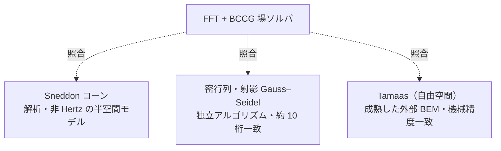

# 検証

hertzian の数値結果は、すべて独立した基準と照合している。このドキュメントは、その
中身、すなわちどの問題を何と比べてどれだけ一致したかをまとめたものである。ソルバの概要や
使い方、設計は [README](../README.md) を参照。

検証は大きく2種類に分かれる。

- **解析解との照合。** 閉じた式を持つ問題（円形 Hertz・楕円 Hertz・Sneddon のコーン）
  は、その式と直接比べる。
- **相互検証。** 閉じた式を持たない問題（粗面接触、重なったゴシックアーチ溝）は、独立に
  実装した別のソルバや外部コードと比べる。詳しくは[相互検証](#相互検証)の節を参照。

[README のギャラリー](../README.md#ギャラリー--可視化)では、各図の左が圧力場、右が解析解
との比較である。その右側の閉形式は、Rust コアとは別に
[`scripts/render_gallery.py`](../scripts/render_gallery.py) で計算し直している。つまり各
比較は、ソルバが自分自身ではなく独立な基準解と一致していることを示す。

---

## 円形 Hertz — 平面上の球（P1）

軸対称のベンチマークである。圧力場は解析的な接触円を満たし、すべての格子セルの圧力を $`r/a`$ に
対してプロットすると Hertz 楕円体に重なる：

$$p(r) = p_0\sqrt{1 - (r/a)^2}.$$

ここでは $`a \approx 0.175\,\mathrm{mm}`$、$`p_0 \approx 780\,\mathrm{MPa}`$ で、解析解と
約 0.2 % で一致する。

## 楕円 Hertz — トーラス外赤道上の球（P2）

凸–凸の接触は楕円となる。求まった接触域は解析的な接触楕円
（$`a_x/a_y \approx 1.92`$）をなぞり、各主軸に沿った断面は解析的な半楕円体プロファイルに
乗る：

$$p(x, y) = p_0\sqrt{1 - (x/a_x)^2 - (y/a_y)^2}, \qquad p_0 \approx 1.74\,\mathrm{GPa}.$$

離心率 $`e`$ は、完全楕円積分 $`K(e),\ E(e)`$ で解いた曲率関係
$`\dfrac{E/(1-e^2) - K}{K - E} = \dfrac{R_x}{R_y}`$ から定まる。

## Sneddon のコーン — 非 Hertz・尖点特異の圧子（P4）

任意（非放物面）のギャップ $`h = m\,r`$ を、測定した表面と同じ「高さ場」の経路で処理する。
Hertz と異なり、圧力は尖点で対数的に発散する。そのため、メッシュに依存するピークそのもの
は比べない。一方、半径方向のプロファイルは Sneddon の閉形式に従う：

$$a = \sqrt{\frac{2P}{\pi E^* m}}, \qquad \delta = \frac{\pi}{2}\,m\,a, \qquad p(r) = \frac{E^* m}{2}\operatorname{arccosh}\!\frac{a}{r}.$$

接触半径 $`a \approx 0.138\,\mathrm{mm}`$ は閉形式と約 0.2 % 以内で一致する。

## 粗面接触 — 球＋粗さ、分裂（P4）

滑らかな球に余弦状の粗さ $`h_r = A\cos(2\pi x/\lambda_x)\cos(2\pi y/\lambda_y)`$ を重ねる
（高さ場の足し算）と、単一の Hertz 円板が突起接触の格子へと分裂する。同じ荷重のもとでも、
実接触面積は滑らかな円板の約 ¼ に減り、ピーク圧は約 5.6 倍に上がる。これは粗面接触に
特有の挙動である。粗いパッチは閉形式を持たないため、独立な密行列ソルバと Tamaas で
相互検証する（[相互検証](#相互検証)を参照）。

---

## ゴシックアーチ溝の検証

ゴシックアーチ溝で玉が2つのフランクに乗ると、接触は2点に分裂する。この分裂は荷重を
保存するため、それ自体が検証にもなる。各フランクは荷重の半分を担う楕円 Hertz 接触であり、
そのピークは P2 ベンチマークと同じ閉形式に乗るはずだからである。

ギャラリーの 65 µm シムの場合、フランク圧は $`p_0 \approx 1.74\,\mathrm{GPa}`$ で、楕円
Hertz パネルと一致する。これは単一アーチのピーク（$`\approx 2.19\,\mathrm{GPa}`$）の
ちょうど $`(1/2)^{1/3} \approx 0.79`$ 倍である。$`y = 0`$ のゴシック点は荷重を担わない。

この数値は、フランク圧がギャラリーの GPa 域に収まるよう選んだ
（$`R_s = 4\,\mathrm{mm}`$、$`r = 4.16\,\mathrm{mm}`$、$`R_0 = 15\,\mathrm{mm}`$、
$`E^* = 100\,\mathrm{GPa}`$、$`P = 800\,\mathrm{N}`$）。各フランクが $`P/2`$ での楕円 Hertz と
等価であることと、非接触のリッジができることは、Rust のシナリオテストと Python バインディング
テストで固定している。

### 半分重なるフランクの検証

子午線方向のフランクオフセットを $`y_0 = b/2`$ とすると（$`b`$ は半荷重の孤立フランク楕円の
子午線半軸）、2つのフランク接触は半分ずつ重なる。重なりがゴシック点を埋めるため、
接触はひと続き（連結）となる。

重なり領域には閉形式がない。2つのフランクが弾性場を通じて相互作用し、荷重が厳密には
$`P/2`$ ずつには分かれないためである。重なりはピーク圧を、分離時の $`(1/2)^{1/3}`$ 倍の値より
押し上げるが、単一アーチ（$`y_0 = 0`$）のピークよりは下に留まる（ここでは
$`\approx 1.85\,\mathrm{GPa}`$ で、分離フランクの $`1.74\,\mathrm{GPa}`$ と単一アーチの
$`2.19\,\mathrm{GPa}`$ の間）。$`20\,\mu\mathrm{m}`$ のシムで $`y_0 \approx 0.51\,\mathrm{mm}`$
となる。

解析的な基準がないため、検証は同じ格子上の独立な密行列・射影 Gauss–Seidel 参照解との
相互検証で行う。連結して荷重を担うゴシック点と、サドルでつながる左右対称の2フランクは、
Rust のシナリオテストと Python バインディングテストで固定している。

---

## 縮約接触則の較正と検証

縮約則は、検証済みの場のソルバを軽量な力則 $`F(\delta)`$ に落とし込んだものである（モデルの
定義は [README](../README.md) の「縮約接触則」の節を参照）。ここでは、横から見た断面での
厳密解との比較と、力則の較正・一致を示す。

### 横から見た断面 — 厳密解と近似解の比較


各パネルの上段が横から見た断面、下段がその子午線圧力断面（厳密＝ソルバ、近似＝解析
Hertz）である。荷重ベクトルは、2つのフランク反力 $`Q_\pm = P/(2\cos\alpha)`$ がフランク法線
$`\hat{n}_\pm`$ を向き、その鉛直成分の和が外部荷重 $`P`$ に釣り合うことを示す。有効フランク数
$`\eta = P/(K\,\delta^{3/2})`$ を、厳密（ソルバ）・カップリング則・素朴な重ね合わせの3通りで
併記している。

- **(a) 単一アーチ — 1つの楕円。** シムがないと2円弧は一致し、接触は全荷重を担う単一の
  楕円 Hertz パッチとなる。荷重ベクトルはまっすぐ上向き（$`\alpha = 0`$）で $`\eta = 1`$
  である。ソルバのピーク（$`\approx 2.18\,\mathrm{GPa}`$）は解析 Hertz（全荷重）と 0.1 % 以内で
  一致する。
- **(b) 半重なり — その中間。** $`y_0 = b/2`$ までシムを開くと、2つのフランク楕円が半分
  重なる。接触が近づいて弾性場が重なり、各フランクが相手の真下を持ち上げるため、$`\eta`$
  は素朴な値 $`2`$ から大きく下がる（ソルバ $`1.44`$）。一次のカップリング則は、その落ち込み
  のほとんどを $`1.54`$ まで取り戻す（残差は約 7 %。点荷重近似が最も弱い最深部である）。
  子午線断面では、ソルバの連結したピークが半荷重フランクの半楕円より上を走る。これが
  重なりによる補強である。
- **(c) 分離2フランク — 左右対称。** さらにシムを開くと（ギャラリーの 65 µm 溝、
  $`\alpha \approx 24^\circ`$）、はっきり分離した左右対称の2フランク接触となる。
  カップリングは薄れ、$`\eta \to {\sim}2`$ に近づく（ソルバ $`1.83`$、カップリング $`1.84`$）。
  ソルバのピークは半荷重 Hertz の半楕円に乗る。

管半径は保形に近く（$`r/R_s = 1.04`$）、実寸では2つの円弧がミクロン単位まで近接して見分けが
つかない。そのため断面では、管半径を模式的に拡大して2つのトーラスを離して描いている
（接触角 $`\alpha`$ と接触位置 $`\pm y_0`$ は厳密値である）。

### フィッティングと検証


$`K`$ は単一アーチの荷重スイープから較正する。

- **パネル A — 較正。** 勾配を自由にした回帰が、Hertz 指数 1.500（理論値 1.5）と
  $`K = P/\delta^{3/2}`$ を $`R^2 = 1.000000`$ で復元する（解析 $`K`$ と 0.2 % 一致）。2フランクの
  点は $`2K`$ の線に重なり、重ね合わせが確認できる。
- **パネル B — 力ベクトル。** 較正済みの $`F(\delta_t, \delta_n)`$ を横断方向にスイープすると、
  離れの先で単一 Hertz の漸近線になめらかに乗る（`C¹`）。
- **パネル C — 除荷フランク。** 除荷するフランクは普遍曲線 $`Q_-/Q_-(0) = (1-\xi)^{3/2}`$ に
  従って接線的にゼロへ近づく。ソルバの非対称な井戸の実験で得たマーカーが、3 % 以内でその上に
  乗る。3/2 乗が、そのまま `C¹` を生む。
- **パネル D — 有効フランク数。** シムを詰めると $`\eta = P/(K\,\delta^{3/2})`$ が 1.95
  （分離した2フランク）から半重なりに向けて 2 を割り込む。隣のフランクが相手を持ち上げる
  一次カップリング（紫線、$`u \sim Q/(\pi E^*\cdot 2 y_0)`$）が $`\eta = 2`$ からのずれをほぼ埋め、
  ソルバ点（橙）を半重なり域まで追う。

大きさ（$`\eta`$）の一致は、半重なりで数 % 以内、分離側で 1 % 未満である。向き（荷重分割
$`P_+ : P_-`$）も、重なりの入口で数 % 以内に再現する。最も詰めた半重なりでは点荷重近似が
最も弱く、残差は約 7 % まで開く。ここから完全合体（$`\eta \to 1`$）までは、単一アーチを
起点にしたなめらかな接続として次の段階に分ける。

$`\eta`$ と分割は Rust のシナリオテスト
（`gothic_coupling_tracks_the_effective_flank_count`、
`gothic_coupling_captures_the_load_split`）で固定している。重心が外側へずれることは
`gothic_overlap_shifts_the_load_centroid_outboard` で固定している。

### パイプラインとしての利用 — `calibrate` と `describe()`

上の較正と検証は、図を描く [`scripts/fit_reduced_law.py`](../scripts/fit_reduced_law.py) だけでなく、
プログラムから数行で実行できる。`hertzian.calibrate(spec)` が物理形状（[`GrooveSpec`](../python/hertzian/calibration.py)）
を係数に還元して純粋関数の法則に差し込み、既定で場ソルバに対する自己検証を走らせる。
`cal.describe()` が、その確認レポート（指数・$`R^2`$・解析 $`K`$ との一致・有効フランク数 $`\eta`$・力評価の
速度比）を返す。代表例（README のギャラリー溝）では、指数 1.5000・$`R^2 = 1.000000`$・
解析 $`K`$ と 0.2 % 一致・$`\eta`$ の一致 0.1 %・場ソルバ比で約 10⁵ 倍の速度が得られ、精度と速度の
両立が一目で確認できる。使い方は [README](../README.md) の「較正パイプライン」の節を、固定は
Python テスト [`tests/test_calibration.py`](../tests/test_calibration.py) を参照。

---

## 面圧キャップの検証

面圧キャップも、検証済みの場のソルバと並べて確かめる（モデルの定義は
[README](../README.md) の「縮約接触則」の節を参照）。本タスクの比較点は、2つのフランクが
半分重なる場合（$`y_0 = b/2`$）である。


- **パネル A — 較正。** ピーク圧スケール $`p_0 = c_p Q^{1/3}`$ を単一アーチの荷重スイープに
  固定すると、ソルバと理論線は 0.998 で一致する（立方根スケールの散らばりはゼロ）。
- **パネル B — 半重なりの断面。** 厳密解（ソルバ、橙）と軽量式を直接並べる。素朴な和は
  継ぎ目を約 +68 % のスパイクに積み上げるが、包絡 $`\max(p_+, p_-)`$（紫）はソルバに
  −4 % で乗り、連結したサドルを再現する。
- **パネル C — 分離溝の2次元キャップ。** クーロンキャップ $`\mu p(x,y)`$ を、接線モデルが下に
  収まるべき2つの楕円の接触域として描き、ソルバの接触縁を重ねる（接触は約 10:1 に細長い
  ため、$`x`$ と $`y`$ の縮尺が異なる）。
- **パネル D — シムを詰めたときのピーク圧。** 分離側 $`y_0/b \ge 1`$ では和も包絡もソルバに
  一致する（和のピーク誤差 0.1 %）。重なり側では素朴な和が過大評価する一方、包絡はソルバを
  全域で追う（スイープ全体でピーク誤差 $`\le 7\,\%`$）。

包絡が捨てる重なりレンズの配り直し、すなわち単一パッチへの完全合体（$`\eta \to 1`$、単一アーチへの
なめらかな接続）は、次の段階に回す。

包絡が分離時に和と一致すること、半重なりでソルバを数 % で追うこと、$`p_0`$ の立方根スケールと
半楕円体の積分の一致は、Rust のシナリオテスト
（`gothic_flank_pressure_caps_the_field_solver`、
`gothic_groove_pressure_envelope_caps_the_overlap`）と Rust／Python のユニットテストで固定
している。

### 非対称な 2:1 面圧キャップの検証

ここまでの面圧キャップは、玉を溝へまっすぐ押し込む対称な押し込みで、2つのフランクが荷重を
等分し、面圧ピークが 1:1 の場合であった。一方、クーロン摩擦が効くのは玉が溝を横切って
引きずられるときで、横断ドライブが荷重を片方のフランクへ寄せ、2つの面圧ピークは開く。
本タスクでは形状はそのままに、横断ドライブだけを与えて面圧ピークが 2:1 となるところまで
寄せた。配置はフランクが干渉するもの、すなわち半重なりのシム $`y_0 = b/2`$ である（2つの
footprint が交差してひと続きの連結パッチとなる、フランク干渉の基本配置）。場ソルバでは横断変位を、
子午線方向の井戸床オフセット $`df`$ として与える（2つのフランク井戸の片方を $`df`$ だけ持ち上げ、
近い側のフランクをそれだけ深く押す、玉の横変位を高さ場で裏返したものである。ギャップは2トーラスの
点ごとの最小のままである）。半重なり（$`y_0 = b/2 \approx 0.51\,\mathrm{mm}`$）では
$`df \approx 5.7\,\mu\mathrm{m}`$ が面圧ピーク比 $`p_+ : p_- = 2.0 : 1`$（$`p_+ \approx 2.15\,\mathrm{GPa}`$、
$`p_- \approx 1.07\,\mathrm{GPa}`$）を生む。2つのフランク接触は重なっており
（`separated = False`）、間を荷重を担うサドル（$`\approx 0.85\,\mathrm{GPa}`$、浅い側クレストの約 79 %）が
つなぐ、ひと続きの連結パッチである。


- **(A) 2:1 への駆動 — 分割の予測。** 横断ドライブ $`df/\delta_0`$ を上げると、2トーラスのピーク比
  $`p_+/p_-`$ が 1:1 から 2:1 へ上がる。各フランクは自分の荷重 $`Q`$ を担う楕円 Hertz パッチで、ピークは
  立方根則 $`p_0 = c_p Q^{1/3}`$ に乗るため、2:1 のピーク比はちょうど 8:1 の荷重分割となる。軽量
  カップリング則の予測 $`(Q_+/Q_-)^{1/3}`$ がソルバ点を 2.5 % 以内で追う。
- **(B) 2:1 干渉断面 — 厳密 vs 軽量。** 半重なり 2:1 ドライブの子午線断面で、ソルバ（厳密、橙点）・
  軽量包絡 $`\max(p_+, p_-)`$（紫）・素朴な和（赤破線）を並べる。2つのクレストはきれいな 2:1
  （$`p_+ \approx 2.15`$、$`p_- \approx 1.07\,\mathrm{GPa}`$）で、間を荷重を担う連結サドルがつなぐ
  （フランクが干渉してひと続きになっている証拠である）。素朴な和は重なりをサドルで二重計上し、サドルで
  約 +135 % も過大評価するが、包絡はソルバピークに −1.0 % で乗り、連結サドルを再現する。
  網掛けは片寄ったクーロンキャップ $`\mu p`$ で、引きずられた側のフランクがトラクションを担う。
- **(C) 2次元クーロンキャップ（連結）。** $`\mu p(x,y)`$ を2つの重なった不等なフランク楕円
  （ひと続きの連結パッチ）として描き、ソルバの連結接触縁を重ねる。大きな主パッチ
  （$`\mu Q_+ \approx 89\,\mathrm{N}`$）と小さな隣パッチ（$`\mu Q_- \approx 11\,\mathrm{N}`$）で、各々が
  $`\mu Q`$ の全滑り摩擦に積分される。
- **(D) シムを詰めて重なりへ。** 横断ドライブを固定したままフランクオフセット $`y_0/b`$ を詰めて分離から
  重なりへ入れると、連結サドルが立ち上がる。素朴な和（赤破線）はサドルを二重計上して過大
  評価する一方、包絡（紫）はソルバ（橙）のサドルを追う。これが「和ではなく包絡」がフランク干渉の
  もとで効く理由である。

2:1 の面圧ピーク（立方根則による約 8:1 の荷重分割）、フランクが重なって連結すること（中央が荷重を
担い、サドルが浅い側クレストの下に立つこと）、包絡クレストがソルバピークに乗り主フランクと一致すること、
素朴な和が重なりをピーク上に二重計上することは、Rust のシナリオテスト
（`gothic_asymmetric_pressure_caps_a_two_to_one_peak`）と Python バインディングテスト
（`test_asymmetric_gothic_flanks_cap_a_two_to_one_peak`）で固定している。なお半重なりでは、軽量
包絡は浅い側フランクを幾何オフセット $`\pm y_0`$ に置くため、そのクレスト位置は、重なりで外側へずれる
実際の荷重重心（前節の二次の方向効果）とわずかにずれる。支配クレストと連結サドルは捉えるが、
位置の補正は、単一アーチへの完全合体とあわせて次の段階に回す。

---

## 相互検証

滑らかな Hertz 接触は閉形式と照合できるが、任意形状、とくに粗面接触には解析的な基準が
ない。P4 ではこれらを、独立した3つの方法で検証する。



| 検証 | 何を固定するか | 場所 |
| ----- | ------------ | ----- |
| **Sneddon のコーン** | 非 Hertz・尖点特異の形状に対する半空間モデル（厳密な接触半径 / 接近量 / 荷重） | `cone_on_flat`, `SneddonCone`（Rust）；`test_cone_matches_sneddon`（Python） |
| **密行列・射影 Gauss–Seidel** | 反復ソルバそのもの。同じカーネル上を無関係なアルゴリズムで解き、分裂した粗いパッチで約10桁一致 | `DenseReference`（Rust）；`rough_sphere_cross_validates_against_the_dense_reference` |
| **Tamaas（自由空間）** | 実装そのもの。成熟した外部 [Tamaas](https://gitlab.com/tamaas/tamaas) 境界要素コードを非周期演算子で動かし、滑らか・粗いギャップともに機械精度で一致 | `tests/test_cross_validation.py` |

連続体 FEM と比べれば、半空間モデルが対象外とする領域（有限厚さや保形形状）まで
踏み込める。`InfluenceOperator` と `Gap` のトレイト境界はそれを差し込む余地を残しており、
一方で上に挙げた厳密弾性論の解析基準は、宣言したスコープの範囲ですでにモデルを固定して
いる。

Tamaas は検証のときだけ使うオプションの依存である。その更新がコアのパイプラインを壊さない
よう、ロック済みのプロジェクト環境からは意図的に外してある。比較は次のコマンドで実行
する：

```sh
uv run --with tamaas pytest tests/test_cross_validation.py
```

---

## 検証テスト一覧

上の検証を固定しているテストの早見表である。

| 範囲 | テスト |
| ---- | ----- |
| Sneddon コーン | `cone_on_flat` / `SneddonCone`（Rust）、`test_cone_matches_sneddon`（Python） |
| 密行列との相互検証 | `rough_sphere_cross_validates_against_the_dense_reference`（Rust） |
| Tamaas との相互検証 | `tests/test_cross_validation.py`（Python） |
| 縮約則のカップリング | `gothic_coupling_tracks_the_effective_flank_count`、`gothic_coupling_captures_the_load_split`（Rust） |
| 荷重重心のずれ | `gothic_overlap_shifts_the_load_centroid_outboard`（Rust） |
| 面圧キャップ | `gothic_flank_pressure_caps_the_field_solver`、`gothic_groove_pressure_envelope_caps_the_overlap`（Rust） |
| 非対称な 2:1 面圧キャップ | `gothic_asymmetric_pressure_caps_a_two_to_one_peak`（Rust）、`test_asymmetric_gothic_flanks_cap_a_two_to_one_peak`（Python） |

図は `make gallery` で再生成する（個別には
[`scripts/render_coupling_cross_section.py`](../scripts/render_coupling_cross_section.py)、
[`scripts/fit_reduced_law.py`](../scripts/fit_reduced_law.py)、
[`scripts/render_pressure_distribution.py`](../scripts/render_pressure_distribution.py)、
[`scripts/render_pressure_distribution_asymmetric.py`](../scripts/render_pressure_distribution_asymmetric.py)）。
matplotlib は描画のためだけに使う依存であり、ロック環境からは意図的に外してある。
