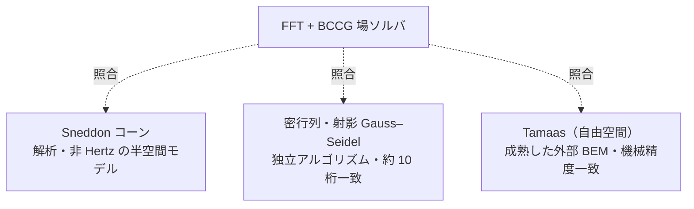

# 検証

hertzian の数値結果は、すべて独立した基準と照合しています。このドキュメントは、その
中身——どの問題を何と比べ、どれだけ一致したか——をまとめたものです。ソルバの概要・
使い方・設計は [README](../README.md) を参照してください。

検証は大きく2種類に分かれます。

- **解析解との照合。** 閉じた式を持つ問題（円形 Hertz・楕円 Hertz・Sneddon のコーン）
  は、その式と直接比べます。
- **相互検証。** 閉じた式を持たない問題（粗面接触、重なったゴシックアーチ溝）は、独立に
  実装した別のソルバや外部コードと比べます。詳しくは[相互検証](#相互検証)の節を参照
  してください。

[README のギャラリー](../README.md#ギャラリー--可視化)では、各図の左が圧力場、右が解析解
との比較です。その右側の閉形式は、Rust コアとは別に
[`scripts/render_gallery.py`](../scripts/render_gallery.py) で計算し直しています。つまり各
比較は、ソルバが自分自身ではなく独立な基準解と一致していることを示します。

---

## 円形 Hertz — 平面上の球（P1）

軸対称のベンチマークです。圧力場は解析的な接触円を満たし、全格子セルの圧力を $r/a$ に
対してプロットすると Hertz 楕円体に重なります：

$$p(r) = p_0\sqrt{1 - (r/a)^2}.$$

ここでは $a \approx 0.175\,\mathrm{mm}$、$p_0 \approx 780\,\mathrm{MPa}$ で、解析解と
約 0.2 % で一致します。

## 楕円 Hertz — トーラス外赤道上の球（P2）

凸–凸の接触は楕円になります。求まった接触域は解析的な接触楕円
（$a_x/a_y \approx 1.92$）をなぞり、各主軸に沿った断面は解析的な半楕円体プロファイルに
乗ります：

$$p(x, y) = p_0\sqrt{1 - (x/a_x)^2 - (y/a_y)^2}, \qquad p_0 \approx 1.74\,\mathrm{GPa}.$$

離心率 $e$ は、完全楕円積分 $K(e),\ E(e)$ で解いた曲率関係
$\dfrac{E/(1-e^2) - K}{K - E} = \dfrac{R_x}{R_y}$ から決まります。

## Sneddon のコーン — 非 Hertz・尖点特異の圧子（P4）

任意（非放物面）のギャップ $h = m\,r$ を、測定した表面と同じ「高さ場」の経路で処理します。
Hertz と違い、圧力は尖点で対数的に発散します。そのため（メッシュに依存する）ピークそのもの
は比べません。一方、半径方向のプロファイルは Sneddon の閉形式に従います：

$$a = \sqrt{\frac{2P}{\pi E^* m}}, \qquad \delta = \frac{\pi}{2}\,m\,a, \qquad p(r) = \frac{E^* m}{2}\operatorname{arccosh}\!\frac{a}{r}.$$

接触半径 $a \approx 0.138\,\mathrm{mm}$ は閉形式と約 0.2 % 以内で一致します。

## 粗面接触 — 球＋粗さ、分裂（P4）

滑らかな球に余弦状の粗さ $h_r = A\cos(2\pi x/\lambda_x)\cos(2\pi y/\lambda_y)$ を重ねる
（高さ場の足し算）と、単一の Hertz 円板が突起接触の格子へと分裂します。同じ荷重のもとで、
実接触面積は滑らかな円板の約 ¼ に減り、ピーク圧は約 5.6 倍に上がります。これは粗面接触に
特有の現れ方です。粗いパッチは閉形式を持たないので、独立な密行列ソルバと Tamaas で
相互検証します（[相互検証](#相互検証)を参照）。

---

## ゴシックアーチ溝の検証

ゴシックアーチ溝で玉が2つのフランクに乗ると、接触は2点に分裂します。この分裂は荷重を
保存し、それ自体が検証にもなります。各フランクは荷重の半分を担う楕円 Hertz 接触なので、
そのピークは P2 ベンチマークと同じ閉形式に乗るはずだからです。

ギャラリーの 65 µm シムの場合、フランク圧は $p_0 \approx 1.74\,\mathrm{GPa}$ で、楕円
Hertz パネルと一致します。これは単一アーチのピーク（$\approx 2.19\,\mathrm{GPa}$）の
ちょうど $(1/2)^{1/3} \approx 0.79$ 倍です。$y = 0$ のゴシック点は荷重を担いません。

この数値は、フランク圧がギャラリーの GPa 域に収まるよう選びました
（$R_s = 4\,\mathrm{mm}$、$r = 4.16\,\mathrm{mm}$、$R_0 = 15\,\mathrm{mm}$、
$E^* = 100\,\mathrm{GPa}$、$P = 800\,\mathrm{N}$）。各フランクが $P/2$ での楕円 Hertz と
等価であること、および非接触のリッジは、Rust のシナリオテストと Python バインディング
テストで固定しています。

### 半分重なるフランクの検証

子午線方向のフランクオフセットを $y_0 = b/2$ にすると（$b$ は半荷重の孤立フランク楕円の
子午線半軸）、2つのフランク接触は半分ずつ重なります。重なりがゴシック点を埋めるので、
接触はひと続き（連結）になります。

重なり領域には閉形式がありません。2つのフランクは弾性場を通じて相互作用し、荷重がきれいに
$P/2$ ずつには分かれないからです。重なりはピーク圧を、分離時の $(1/2)^{1/3}$ 倍の値より
押し上げますが、単一アーチ（$y_0 = 0$）のピークよりは下に留まります（ここでは
$\approx 1.85\,\mathrm{GPa}$ で、分離フランクの $1.74\,\mathrm{GPa}$ と単一アーチの
$2.19\,\mathrm{GPa}$ の間）。$20\,\mu\mathrm{m}$ のシムで $y_0 \approx 0.51\,\mathrm{mm}$
になります。

解析的な基準がないので、検証は同じ格子上の独立な密行列・射影 Gauss–Seidel 参照解との
相互検証で行います。連結して荷重を担うゴシック点と、サドルでつながる左右対称の2フランクは、
Rust のシナリオテストと Python バインディングテストで固定しています。

---

## 縮約接触則の較正と検証

縮約則は、検証済みの場のソルバを軽量な力則 $F(\delta)$ に落とし込んだものです（モデルの
定義は [README](../README.md) の「縮約接触則」の節を参照）。ここでは、横から見た断面での
厳密解との比較と、力則の較正・一致を示します。

### 横から見た断面 — 厳密解と近似解の比較


各パネルの上段が横から見た断面、下段がその子午線圧力断面（厳密＝ソルバ、近似＝解析
Hertz）です。荷重ベクトルは、2つのフランク反力 $Q_\pm = P/(2\cos\alpha)$ がフランク法線
$\hat{n}_\pm$ を向き、その鉛直成分の和が外部荷重 $P$ に釣り合うことを示します。有効フランク数
$\eta = P/(K\,\delta^{3/2})$ を、厳密（ソルバ）・カップリング則・素朴な重ね合わせの3通りで
併記しています。

- **(a) 単一アーチ — 1つの楕円。** シムがないと2円弧は一致し、接触は全荷重を担う単一の
  楕円 Hertz パッチになります。荷重ベクトルはまっすぐ上向き（$\alpha = 0$）で $\eta = 1$
  です。ソルバのピーク（$\approx 2.18\,\mathrm{GPa}$）は解析 Hertz（全荷重）と 0.1 % 以内で
  一致します。
- **(b) 半重なり — その中間。** $y_0 = b/2$ までシムを開くと、2つのフランク楕円が半分
  重なります。接触が近づいて弾性場が重なり、各フランクが相手の真下を持ち上げるため、$\eta$
  は素朴な値 $2$ から大きく下がります（ソルバ $1.44$）。一次のカップリング則は、その落ち込み
  のほとんどを $1.54$ まで取り戻します（残差は約 7 %。点荷重近似が最も弱い最深部です）。
  子午線断面では、ソルバの連結したピークが半荷重フランクの半楕円より上を走ります。これが
  重なりによる補強です。
- **(c) 分離2フランク — 左右対称。** さらにシムを開くと（ギャラリーの 65 µm 溝、
  $\alpha \approx 24^\circ$）、はっきり分離した左右対称の2フランク接触になります。
  カップリングは薄れ、$\eta \to {\sim}2$ に近づきます（ソルバ $1.83$、カップリング $1.84$）。
  ソルバのピークは半荷重 Hertz の半楕円に乗ります。

管半径は保形に近く（$r/R_s = 1.04$）、実寸では2つの円弧がミクロン単位まで近接して見分けが
つきません。そのため断面では、管半径を模式的に拡大して2つのトーラスを離して描いています
（接触角 $\alpha$ と接触位置 $\pm y_0$ は厳密値です）。

### フィッティングと検証


$K$ は単一アーチの荷重スイープから較正します。

- **パネル A — 較正。** 勾配を自由にした回帰が Hertz 指数 **1.500**（理論値 1.5）と
  $K = P/\delta^{3/2}$ を $R^2 = 1.000000$ で復元します（解析 $K$ と 0.2 % 一致）。2フランクの
  点は $2K$ の線に重なり、重ね合わせが確認できます。
- **パネル B — 力ベクトル。** 較正済みの $F(\delta_t, \delta_n)$ を横断方向にスイープすると、
  離れの先で単一 Hertz の漸近線になめらかに乗ります（`C¹`）。
- **パネル C — 除荷フランク。** 除荷するフランクは普遍曲線 $Q_-/Q_-(0) = (1-\xi)^{3/2}$ に
  従って接線的にゼロへ近づきます。ソルバの非対称な井戸の実験のマーカーが、3 % 以内でその上に
  乗ります。3/2 乗がそのまま `C¹` を生むわけです。
- **パネル D — 有効フランク数。** シムを詰めると $\eta = P/(K\,\delta^{3/2})$ が **1.95**
  （分離した2フランク）から半重なりに向けて 2 を割り込みます。隣のフランクが相手を持ち上げる
  一次カップリング（紫線、$u \sim Q/(\pi E^*\cdot 2 y_0)$）が $\eta = 2$ からのずれをほぼ埋め、
  ソルバ点（橙）を半重なり域まで追います。

大きさ（$\eta$）の一致は、半重なりで数 % 以内、分離側で 1 % 未満です。向き（荷重分割
$P_+ : P_-$）も、重なりの入口で数 % 以内に再現します。最も詰めた半重なりでは点荷重近似が
最も弱く、残差は約 7 % まで開きます。ここから完全合体（$\eta \to 1$）までは、単一アーチを
起点にしたなめらかな接続として次の段階に分けます。

$\eta$ と分割は Rust のシナリオテスト
（`gothic_coupling_tracks_the_effective_flank_count`、
`gothic_coupling_captures_the_load_split`）で固定しています。重心が外側へずれることは
`gothic_overlap_shifts_the_load_centroid_outboard` で固定しています。

---

## 面圧キャップの検証

面圧キャップも、検証済みの場のソルバと並べて確かめます（モデルの定義は
[README](../README.md) の「縮約接触則」の節を参照）。本タスクの比較点は、2つのフランクが
半分重なる場合（$y_0 = b/2$）です。


- **パネル A — 較正。** ピーク圧スケール $p_0 = c_p Q^{1/3}$ を単一アーチの荷重スイープに
  固定すると、ソルバと理論線は **0.998** で一致します（立方根スケールの散らばりはゼロ）。
- **パネル B — 半重なりの断面。** 厳密解（ソルバ、橙）と軽量式を直接並べます。素朴な和は
  継ぎ目を **約 +68 %** のスパイクに積み上げますが、包絡 $\max(p_+, p_-)$（紫）はソルバに
  **−4 %** で乗り、連結したサドルを再現します。
- **パネル C — 分離溝の2次元キャップ。** クーロンキャップ $\mu p(x,y)$ を、接線モデルが下に
  収まるべき2つの楕円の接触域として描き、ソルバの接触縁を重ねます（接触は約 10:1 に細長い
  ので、$x$ と $y$ の縮尺が異なります）。
- **パネル D — シムを詰めたときのピーク圧。** 分離側 $y_0/b \ge 1$ では和も包絡もソルバに
  一致します（和のピーク誤差 0.1 %）。重なり側では素朴な和が過大評価する一方、包絡はソルバを
  全域で追います（スイープ全体でピーク誤差 $\le 7\,\%$）。

包絡が捨てる重なりレンズの配り直し——単一パッチへの完全合体（$\eta \to 1$、単一アーチへの
なめらかな接続）——は次の段階に回します。

包絡が分離時に和と一致すること、半重なりでソルバを数 % で追うこと、$p_0$ の立方根スケールと
半楕円体の積分の一致は、Rust のシナリオテスト
（`gothic_flank_pressure_caps_the_field_solver`、
`gothic_groove_pressure_envelope_caps_the_overlap`）と Rust／Python のユニットテストで固定
しています。

### 非対称な 2:1 面圧キャップの検証

ここまでの面圧キャップは、玉を溝へ**まっすぐ**押し込む対称な押し込みで、2つのフランクが荷重を
等分し面圧ピークが 1:1 の場合でした。けれどもクーロン摩擦が効くのは玉が溝を**横切って引きずられる**
ときで、横断ドライブが荷重を片方のフランクへ寄せ、2つの面圧ピークは開きます。**形状はそのまま**
（2トーラスのフランク干渉モデル）に横断ドライブだけを与え、面圧ピークが**2:1**になるところまで
寄せたのが本タスクの解析です。場ソルバでは横断変位を子午線方向の**井戸床オフセット** $df$——
2つのフランク井戸の片方を $df$ だけ持ち上げ、近い側のフランクをそれだけ深く押す、玉の横変位の
高さ場での裏返し——として与えます（ギャップは2トーラスの点ごとの最小のまま）。ギャラリーと同じ
保形溝（分離フランク $y_0 \approx 1.63\,\mathrm{mm}$、65 µm シム相当）で $df \approx 6.9\,\mu\mathrm{m}$
が面圧ピーク比 $p_+ : p_- = 2.00 : 1$（$p_+ \approx 2.10\,\mathrm{GPa}$、$p_- \approx 1.05\,\mathrm{GPa}$）
を生みます。


- **(A) 較正 — 両フランクが同じ立方根線に乗る。** 横断ドライブをスイープすると、深い側 $p_+$ と
  浅い側 $p_-$ の両クレストが単一の立方根線 $c_p Q^{1/3}$ に乗ります（ソルバ/線 **1.0007**、散らばり
  ほぼゼロ）。各フランクが自分の荷重 $Q$ を担う楕円 Hertz パッチである証拠で、ピークは立方根で
  スケールするので、**2:1 のピーク比はちょうど 8:1 の荷重分割**になります（$Q_+ \approx 711$、
  $Q_- \approx 89\,\mathrm{N}$、分割 $8.0$）。
- **(B) 2:1 断面 — 厳密 vs 軽量。** 2:1 ドライブの子午線断面で、ソルバ（厳密、橙点）と軽量包絡
  $\max(p_+, p_-)$（紫）を並べます。2つのクレストはきれいな 2:1 で、footprint は分離している
  （$2 y_0 \ge a_y^+ + a_y^-$）ので包絡は和と一致し、ソルバに **−0.0 %** で乗ります。網掛けは
  クーロンキャップ $\mu p$——いまや片寄って、引きずられた側のフランクがトラクションを担います。
- **(C) 2次元クーロンキャップ。** $\mu p(x,y)$ を2つの**不等な**フランク楕円として描き、ソルバの
  接触縁を重ねます。大きな主パッチ（$\mu Q_+ \approx 85\,\mathrm{N}$）と小さな隣パッチ
  （$\mu Q_- \approx 11\,\mathrm{N}$）で、各々が $\mu Q$ の全滑り摩擦に積分されます。
- **(D) 分割の予測。** 横断ドライブを上げると、2トーラスのピーク比が 1:1 から 2:1 へ上がります。
  軽量カップリング則の予測 $(Q_+/Q_-)^{1/3}$ がソルバ点を全域で **0.4 % 以内**で追います。

2:1 の面圧ピーク（立方根則による ~8:1 荷重分割）、両クレストが $c_p Q^{1/3}$ に乗ること、包絡
クレストがソルバピークに乗り主フランクと一致すること、各キャップが荷重に積分されることは、Rust の
シナリオテスト（`gothic_asymmetric_pressure_caps_a_two_to_one_peak`）と Python バインディング
テスト（`test_asymmetric_gothic_flanks_cap_a_two_to_one_peak`）で固定しています。

---

## 相互検証

滑らかな Hertz 接触は閉形式と照合できますが、任意形状、とくに粗面接触には解析的な基準が
ありません。P4 ではこれらを、独立した3つの方法で検証します。



| 検証 | 何を固定するか | 場所 |
| ----- | ------------ | ----- |
| **Sneddon のコーン** | 非 Hertz・尖点特異の形状に対する半空間*モデル*（厳密な接触半径 / 接近量 / 荷重） | `cone_on_flat`, `SneddonCone`（Rust）；`test_cone_matches_sneddon`（Python） |
| **密行列・射影 Gauss–Seidel** | *反復ソルバ*そのもの。同じカーネル上を無関係なアルゴリズムで解き、分裂した粗いパッチで約10桁一致 | `DenseReference`（Rust）；`rough_sphere_cross_validates_against_the_dense_reference` |
| **Tamaas（自由空間）** | *実装*そのもの。成熟した外部 [Tamaas](https://gitlab.com/tamaas/tamaas) 境界要素コードを非周期演算子で動かし、滑らか・粗いギャップともに機械精度で一致 | `tests/test_cross_validation.py` |

連続体 **FEM** と比べれば、半空間モデルが対象外とする領域（有限厚さや保形形状）まで
踏み込めます。`InfluenceOperator` と `Gap` のトレイト境界はそれを差し込む余地を残しており、
一方で上に挙げた厳密弾性論の解析基準は、宣言したスコープの範囲ですでにモデルを固定して
います。

Tamaas は検証のときだけ使うオプションの依存です。その更新がコアのパイプラインを壊さない
よう、ロック済みのプロジェクト環境からは意図的に外しています。比較は次のコマンドで実行
します：

```sh
uv run --with tamaas pytest tests/test_cross_validation.py
```

---

## 検証テスト一覧

上の検証を固定しているテストの早見表です。

| 範囲 | テスト |
| ---- | ----- |
| Sneddon コーン | `cone_on_flat` / `SneddonCone`（Rust）、`test_cone_matches_sneddon`（Python） |
| 密行列との相互検証 | `rough_sphere_cross_validates_against_the_dense_reference`（Rust） |
| Tamaas との相互検証 | `tests/test_cross_validation.py`（Python） |
| 縮約則のカップリング | `gothic_coupling_tracks_the_effective_flank_count`、`gothic_coupling_captures_the_load_split`（Rust） |
| 荷重重心のずれ | `gothic_overlap_shifts_the_load_centroid_outboard`（Rust） |
| 面圧キャップ | `gothic_flank_pressure_caps_the_field_solver`、`gothic_groove_pressure_envelope_caps_the_overlap`（Rust） |
| 非対称な 2:1 面圧キャップ | `gothic_asymmetric_pressure_caps_a_two_to_one_peak`（Rust）、`test_asymmetric_gothic_flanks_cap_a_two_to_one_peak`（Python） |

図は `make gallery` で再生成します（個別には
[`scripts/render_coupling_cross_section.py`](../scripts/render_coupling_cross_section.py)、
[`scripts/fit_reduced_law.py`](../scripts/fit_reduced_law.py)、
[`scripts/render_pressure_distribution.py`](../scripts/render_pressure_distribution.py)、
[`scripts/render_pressure_distribution_asymmetric.py`](../scripts/render_pressure_distribution_asymmetric.py)）。
matplotlib は描画のためだけに使う依存で、ロック環境からは意図的に外しています。
